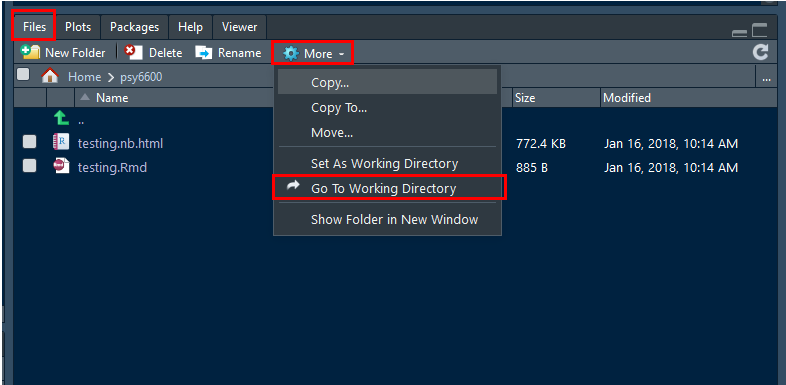

# GETTING YOUR COMPUTER READY {-}


## What is R? {-}

R is a language and environment for statistical computing and graphics. [@R-base]

R provides a wide variety of statistical (linear and nonlinear modelling, classical statistical tests, time-series analysis, classification, clustering, ...) and graphical techniques, and is highly extensible. The S language is often the vehicle of choice for research in statistical methodology, and R provides an Open Source route to participation in that activity.

One of R’s strengths is the ease with which well-designed publication-quality plots can be produced, including mathematical symbols and formulae where needed. Great care has been taken over the defaults for the minor design choices in graphics, but the user retains full control.


-------------------------------

## What is R Markdown? {-}

According to [R Studio](www.rstudio.com):

> "R Markdown is a format that enables easy authoring of reproducible web reports from R. It combines the core syntax of Markdown (an easy-to-write **plain text** format for web content) with embedded **R code chunks** that are run so their output can be included in the final document".


-------------------------------

## Dynamic Reporting {-}

From [Penn State Statistics](https://onlinecourses.science.psu.edu/statprogram/markdown): 

### The **traditional way** to write a report {-}

1. Run your analysis in software, like SPSS or R and manually save our output
    * *i.e. saving the ANOVA table or using pdf() to save the graphs*  

2. Type your your description and interpretation in a text editor like *Word*
    * *either drag/drop tables and figures, or worse copy-paste and retype all the numbers*

A report written in this way can be problematic.  For instance, imagine your *Mentor/collaborator/journal reviewer*  telling you that they want to use a sub-sample instead of the entire sample. Or to include a nother variable.  You would have to redo all of your work!! 

Therefore, in this way **dynamic also means reproducible**, in the sense that people who get the file from you can reproduce the entire work in the report.


### How does R Markdown work out to be a .pdf or .html file?  {-}

`R Markdown` is a file with the file extension **.Rmd**, the `knitr` package will then transform the file into a **Markdown** file with the extension **.md.** Then Rstudio can:

  * Use `LaTeX` to transform the file into a **.pdf** 
    
  * Load another package called `markdown` to transform the file into **.html**   
    
  * Use Pandoc to even convert to file to a **Word** document (ugly)


### Is this a **popular** method for creating reports?  {-}

Check out [Rpubs](http://rpubs.com/). This website shares lots of documents written in the way we will introduce below.


-------------------------------

## Background Information {-}


 
> `R Markdown` documents are fully reproducible. Use a productive **notebook** interface to weave together narrative text and code to produce elegantly formatted output. Use multiple languages including R, Python, and SQL [@R-rmarkdown].


> `knitr` is an engine for dynamic report generation with R. It is a package in the statistical programming language R that enables integration of **R code** into LaTeX, LyX, HTML, Markdown, AsciiDoc, and **text** documents [@R-knitr].

-------------------------------


## Software Programs {-}

You will need to download and install THREE programs to create dynamic reports in.


### 1. `R` from [www.r-project.org](http://www.r-project.org) {-}

Get the latest released version of FREE **Base** R from CRAN 

* Choose a mirror close to your location
* Select **base** R for your computer *(Windows, Mac, ect.)*
* The defaults are good...don't change them...just keep clicking *'Next'*


### 2 `R Studio` from [www.rstudio.com](http://www.rstudio.com) {-}

Get the latest version of the FREE Open Source **Desktop** Edition of R Studio

* The defaults are good...don't change them...just keep clicking *'Next'*


### 3. `LaTeX` depends on your operating system {-}


> **Mac:** `MacTeX` from [http://tug.org/mactex/](http://tug.org/mactex/) 

* Download (5+ min) to a folder and them double click on the **PKG file**
* Follow the installation instructions.
* You don't need to open anything after MacTeX is finished installing.  
    
     
    
> **Windows:** `MikTeX` [http://miktex.org/download](http://miktex.org/download)

* Pick the latest version of the **Net Installer**, not the Basic! 
* You need the full version 64-bit is better, if you have a 64-bit machine
* When your download is complete, run the downloaded installer. 
* Windows may ask you if you want to *“allow this app from an unknown publisher to make changes to your PC”*. If it does, make sure to click **Yes!**
* This is the slowest part...


-------------------------------

    
## R Packages  {-}

> **R packages** are collections of functions and data sets developed by the community. They increase the power of **R** by improving existing base **R** functionalities, or by adding new ones.

More information may be found here:  https://www.datacamp.com/community/tutorials/r-packages-guide 


### Installing Packages (via the user interface) {-}

> You only need to install packages ONCE per computer.

In **R Stuido**:

1. Click on the **Packages** tab the panel with the most tabs
2. Click on the word **Instsall** just under and to the left of the tab
2. In the **Packages** box, type in the name of the packages you would like to download.  You can do several at once, just seperate them with multiple spaces or a comma.

*Note: Leave the installation library path as the default.  Also, make sure the box for 'Installing dependencies' is checked.*


### Load Packages (via code) {-}

> You will need to load packages in EVERY SESSION you want to use them in.


```r
library(tidyverse)
```

Please don’t get confused: `library()` is the command used to **load a package**, and it refers to the **place** where the package is contained, usually a folder on your computer, while a package is the collection of functions bundled conveniently.

Maybe it can help a quote from **Hadley Wickham**, Chief data scientist at RStudio, and instructor of the *“Writing functions in R”* DataCamp course (December 8, 2014):

> "a package is a like a book, a library is like a library; you use `library()` to check a package out of the library"

Here is link to an AWSOME ['cheat sheet' for begginers working with the `tidyverse` package](http://datacamp-community.s3.amazonaws.com/e63a8f6b-2aa3-4006-89e0-badc294b179c).  I highly suggest checking it out.

More 'cheat sheets' are available under the "Help" menu option in **R Studio**


## Kniting Notebooks {-}

### Storing all associated files  {-}

If you are using any files, such as *datasets* or *images*, they need to be stored in the same folder location as the R Notebook (`.Rmd` file).

This folder location must be the **Working Directory** for the R Studio session.  If you opened your `.Rmd` notebook file by double-clicking on its name, then this should be the case.  

### Setting the working directory  {-}

To ensure that R Studio knows where to find the files, you can manually set the **Working Directory** through the menu:

* Click `Session`
* Select `Set Working Directory` by hovering your mouse over it
* Click on `To Source File Location`


You can double check that you were successful by 

* Click on the `Files` tab in the many-tab panel
* Click on the button with the gear that says `More`
* Click `Go To Working Directory`

At this point you should see all the files that reside in the folder location where the open `.Rmd` files is also saved. 




