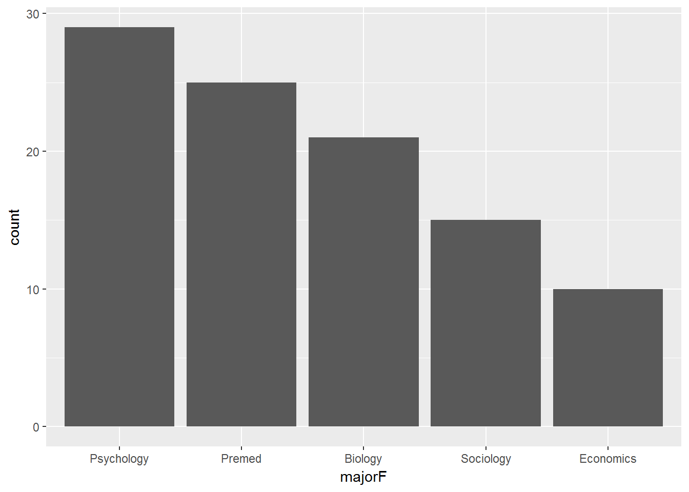
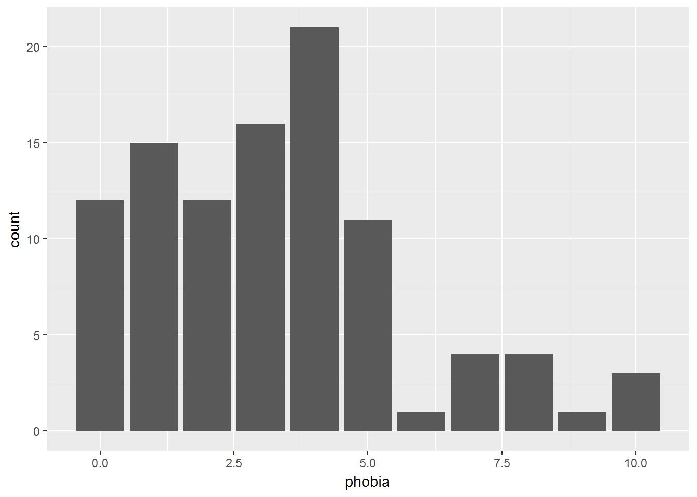

# EXAMINING A DISTRIBUTION

LINK TO: [Slide Show - Chapter 2](http://tysonbarrett.com/EDUC-6600/Slides/01_Ch2_DataViz.html#1)


## Packages Needed {-}


```r
library(tidyverse)
library(readxl)
library(furniture)
```


---------------------------------------

## Frequency Distrubutions

> These tables are best for showing the breakdown of a sample across the levels of a single CATEGORICAL variable.  They help pick out the mode(s) and identify unusual or impossible values.


```r
data_clean %>%                 
  furniture::tableF(major)
```

```

------------------------------------
 major Freq CumFreq Percent CumPerc
 1     29   29      29.00%  29.00% 
 2     25   54      25.00%  54.00% 
 3     21   75      21.00%  75.00% 
 4     15   90      15.00%  90.00% 
 5     10   100     10.00%  100.00%
------------------------------------
```


```r
data_clean %>% 
  furniture::tableF(phobia)
```

```

-------------------------------------
 phobia Freq CumFreq Percent CumPerc
 0      12   12      12.00%  12.00% 
 1      15   27      15.00%  27.00% 
 2      12   39      12.00%  39.00% 
 3      16   55      16.00%  55.00% 
 4      21   76      21.00%  76.00% 
 5      11   87      11.00%  87.00% 
 6      1    88      1.00%   88.00% 
 7      4    92      4.00%   92.00% 
 8      4    96      4.00%   96.00% 
 9      1    97      1.00%   97.00% 
 10     3    100     3.00%   100.00%
-------------------------------------
```

---------------------------------------

## Bar Charts

> These plots are best for showing the breakdown of a sample across the levels of a single CATEGORICAL variable.  They help pick out the mode(s) and identify unusual or impossible values.

**There must be SPACE between the bars!**


```r
data_clean %>% 
  ggplot(aes(major)) +
  geom_bar()
```


```r
data_clean %>% 
  ggplot(aes(coffee)) +
  geom_bar()
```


--------------------------------

## Histograms

> These plots are best for showing the distribution of a single CONTINUOUS variable.  They help visually determine the shape, center *[mean, median, mode(s)]*, spread *[stadard deviation, range]*, and identify extreme or impossible values.


```r
data_clean %>% 
  ggplot(aes(phobia)) +
  geom_histogram()
```


**There must NOT be SPACE between the bars!**

Notice how the bars do not touch.  This is because the default includes too many bars, many of which are not included in the dataset.  

There are TWO ways specify somthing other than the default:

(@) Change the NUMBER of bins: `bins = #`
(@) Change the WIDTH of the bins: `binwidth = #`

> If you try to do BOTH, only the first option will be used and the second will be ignored.

### Change the Number of Bins


```r
data_clean %>% 
  ggplot(aes(phobia)) +
  geom_histogram(bins = 8)
```


### Change the Bin Width


```r
data_clean %>% 
  ggplot(aes(phobia)) +
  geom_histogram(binwidth = 5)
```




### Make Seperate Panels -by- a Factor

> To make seperate plots based on another variable, A FACTOR, we need to add a layer to the plot.


```r
data_clean %>% 
  ggplot(aes(mathquiz)) +
  geom_histogram(binwidth = 4) +
  facet_grid(. ~ coffeeF)
```


```r
data_clean %>% 
  ggplot(aes(mathquiz)) +
  geom_histogram(binwidth = 4) +
  facet_grid(coffeeF ~ .)
```




------------------------------

## Quartiles, Deciles, and Percentiles


### Deciles (break into 10% chunks)


```r
data_clean %>% 
  dplyr::pull(statquiz) %>% 
  quantile(probs = c(.10, .20, .30, .40, .50, .60, .70, .80, .90))
```

```
10% 20% 30% 40% 50% 60% 70% 80% 90% 
4.0 6.0 6.0 7.0 7.0 8.0 8.0 8.0 8.1 
```


### With Missing Values: throws an error


```r
data_clean %>% 
  dplyr::pull(mathquiz) %>% 
  quantile(probs = c(.10, .20, .30, .40, .50, .60, .70, .80, .90))
```

`Error in quantile.default(., probs = c(0.1, 0.2, 0.3, 0.4, 0.5, 0.6, 0.7, : missing values and NaN's not allowed if 'na.rm' is FALSE`

### Option to Ignore Missing Values: `na.rm = TRUE`


```r
data_clean %>% 
  dplyr::pull(mathquiz) %>% 
  quantile(probs = c(.10, .20, .30, .40, .50, .60, .70, .80, .90),
           na.rm =TRUE)
```

```
 10%  20%  30%  40%  50%  60%  70%  80%  90% 
15.0 21.0 25.2 28.0 30.0 32.0 33.8 37.2 41.0 
```

### Quartiles (break into 4 chunks)


```r
data_clean %>% 
  dplyr::pull(statquiz) %>% 
  quantile(probs = c(0, .25, .50, .75, 1))
```

```
  0%  25%  50%  75% 100% 
   1    6    7    8   10 
```


### Other Percentiles 


```r
data_clean %>% 
  dplyr::pull(statquiz) %>% 
  quantile(probs = c(.01, .05, .173, .90))
```

```
   1%    5% 17.3%   90% 
 2.98  3.00  5.00  8.10 
```
