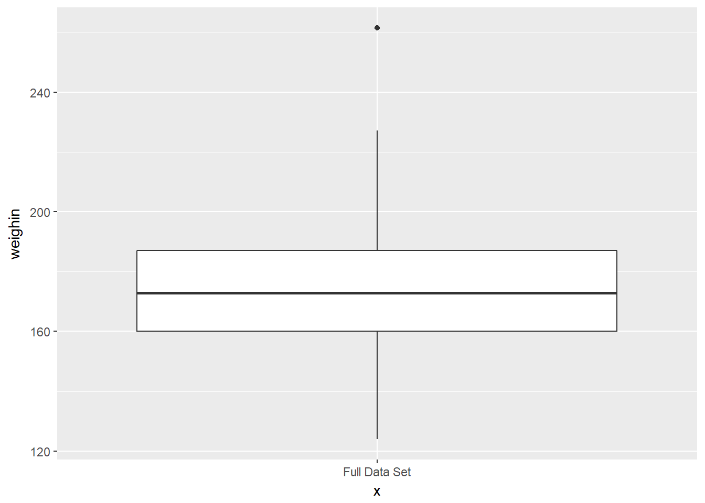
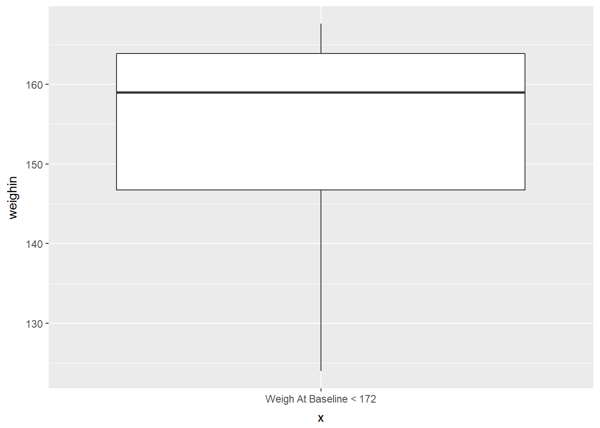
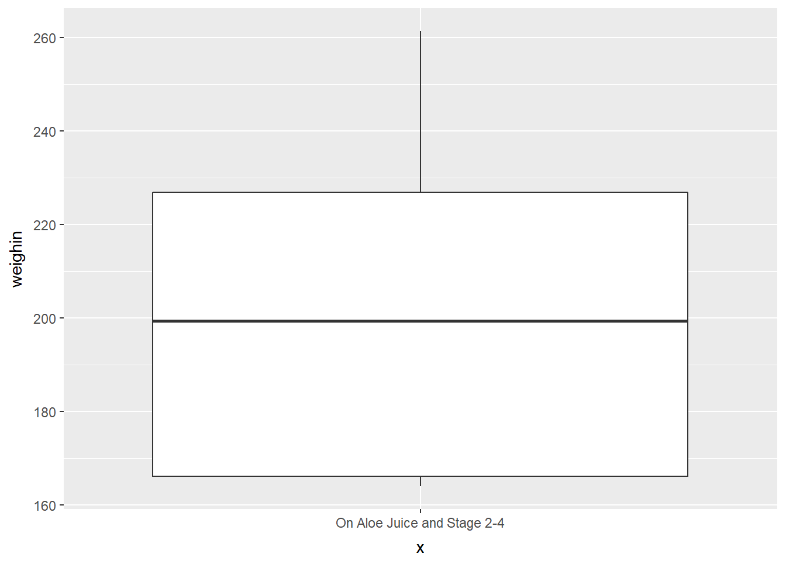
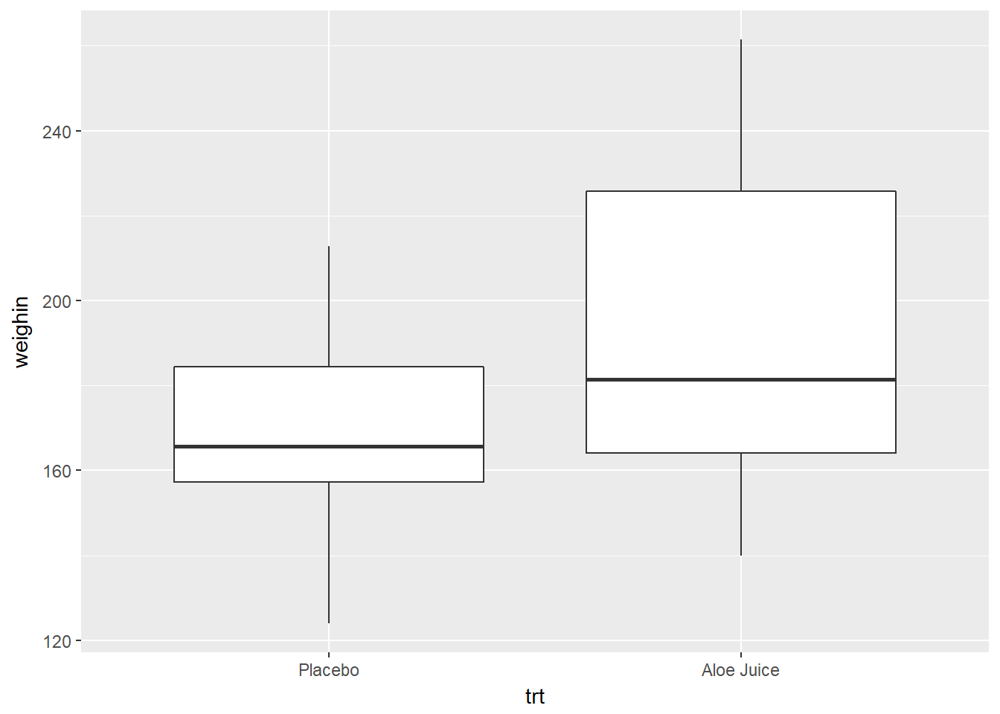
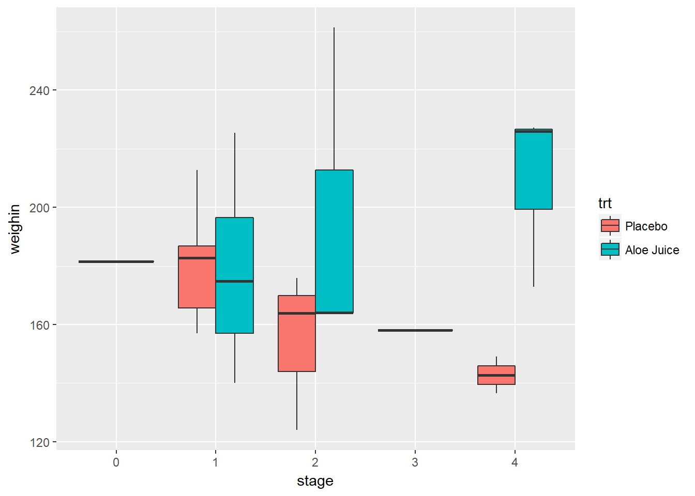
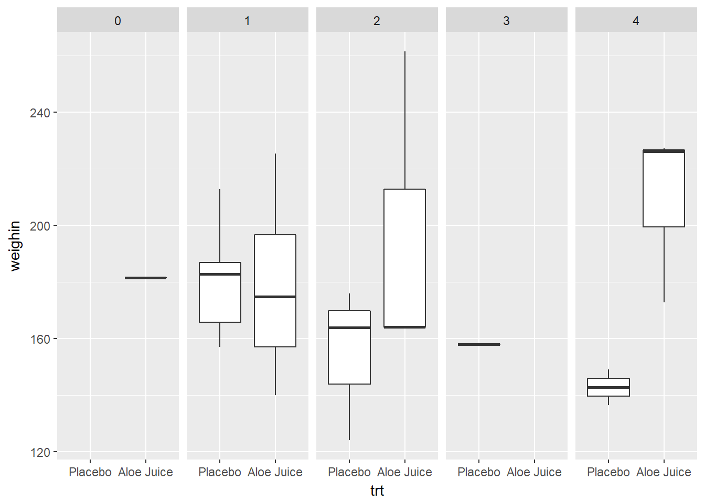
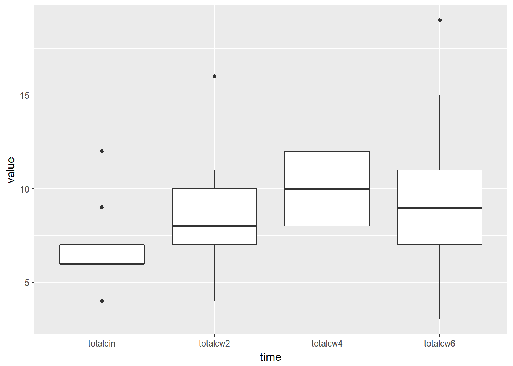
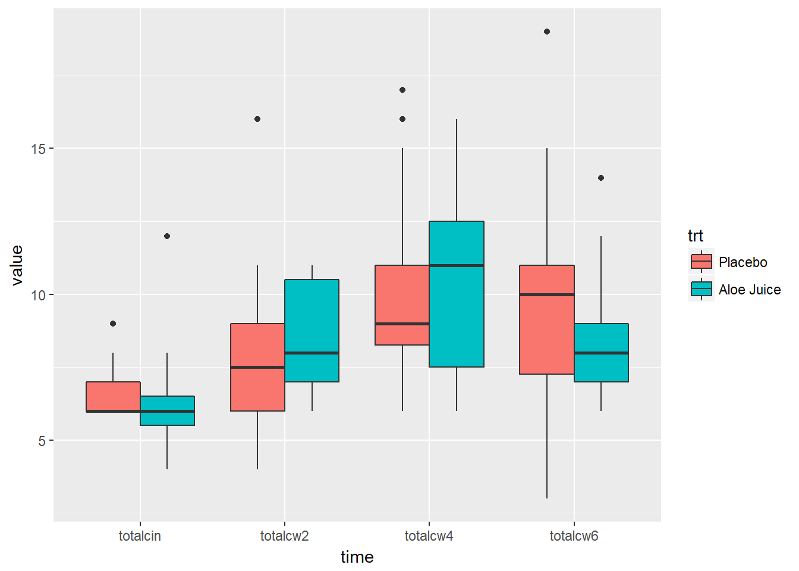
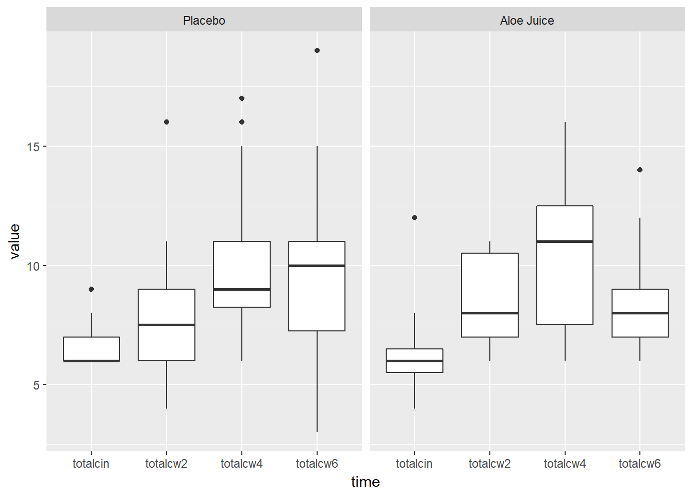

# SUMMARY STATISTICS

## Chapter Links {-}

* [Chapter 3 Slide Show](http://tysonbarrett.com/EDUC-6600/Slides/01_Ch3_CenterSpread.html#1)

* [Unit 1 Assignment - Write Up Skeleton](https://usu.box.com/s/bn0m44cp5zrkev3ppjdilfsvic4bubvu)

* [Unit 1 Assignment - Rmd Skeleton](https://usu.box.com/s/zjjwexn827ziifxlcoe6emr2brfifk0x)

* [Inho's Dataset - Excel format](https://usu.box.com/s/hyky7eb24l6vvzj2xboedhcx1xolrpw1)

* [Cancer Dataset - SPSS format](https://usu.box.com/s/9c92zof5whb76bphmzxn3vqx5702qgq6)


## Example: Cancer Experiment {-}

#### Source of Data {-}

Mid-Michigan Medical Center, Midland, Michigan, 1999: A  study of oral condition of cancer patients.

#### Description of the Study {-}

The data set contains part of the data for a study of oral condition of cancer patients conducted at the Mid-Michigan Medical Center.  The oral conditions of the patients were measured and recorded at the initial stage, at the end of the second week, at the end of the fourth week, and at the end of the sixth week.  The variables age, initial weight and initial cancer stage of the patients were recorded.  Patients were divided into two groups at random:  One group received a placebo and the other group received aloe juice treatment.

Sample size n = 25 patients with neck cancer. The treatment is Aloe Juice. 

#### Variables Included {-}

* `ID` patient identification number

* `trt` treatment group 
    + `0` *placebo* 
    + `1` *aloe juice*

* `age` patient's age, *in years*

* `weightin` patient's weight *(pounds)* at the initial stage

* `stage`	initial cancer stage
    + coded `1` through `4`

* `totalcin` oral condition at the *initial stage*
* `totalcw2` oral condition at the end of *week 2*
* `totalcw4` oral condition at the end of *week 4*
* `totalcw6` oral condition at the end of *week 6*


### Required Packages {-}


```r
library(tidyverse)    # Loads several very helpful 'tidy' packages
library(haven)        # Read in SPSS datasets
library(furniture)    # Nice tables (by our own Tyson Barrett)
library(psych)        # Lots of nice tid-bits
```


### Data Import {-}

The `Cancer` dataset is saved in SPSS format, which is evident from the `.sav` ending on the file name.

The `haven` package is downloaded as part of the `tidyverse` set of packages, but is not automatically loaded.  It must have its own `library()` function call *(see above)*.  The `haven::read_spss()` function works very simarly to the `readxl::read_excel()` function we used last chapter [@R-haven].

* Make sure the **dataset** is saved in the same *folder* as this file
* Make sure the that *folder* is the **working directory**


```r
cancer_raw <- haven::read_spss("cancer.sav")
```


```r
tibble::glimpse(cancer_raw)
```

```
Observations: 25
Variables: 9
$ ID       <dbl> 1, 5, 6, 9, 11, 15, 21, 26, 31, 35, 39, 41, 45, 2, 12...
$ TRT      <dbl> 0, 0, 0, 0, 0, 0, 0, 0, 0, 0, 0, 0, 0, 0, 1, 1, 1, 1,...
$ AGE      <dbl> 52, 77, 60, 61, 59, 69, 67, 56, 61, 51, 46, 65, 67, 4...
$ WEIGHIN  <dbl> 124.0, 160.0, 136.5, 179.6, 175.8, 167.6, 186.0, 158....
$ STAGE    <dbl> 2, 1, 4, 1, 2, 1, 1, 3, 1, 1, 4, 1, 1, 2, 4, 1, 2, 1,...
$ TOTALCIN <dbl> 6, 9, 7, 6, 6, 6, 6, 6, 6, 6, 7, 6, 8, 7, 6, 4, 6, 6,...
$ TOTALCW2 <dbl> 6, 6, 9, 7, 7, 6, 11, 11, 9, 4, 8, 6, 8, 16, 10, 6, 1...
$ TOTALCW4 <dbl> 6, 10, 17, 9, 16, 6, 11, 15, 6, 8, 11, 9, 9, 9, 11, 8...
$ TOTALCW6 <dbl> 7, 9, 19, 3, 13, 11, 10, 15, 8, 7, 11, 6, 10, 10, 9, ...
```


### Data Wrangling {-}


```r
cancer_clean <- cancer_raw %>% 
  dplyr::rename_all(tolower) %>% 
  dplyr::mutate(id = factor(id)) %>% 
  dplyr::mutate(trt = factor(trt,
                             labels = c("Placebo", 
                                        "Aloe Juice"))) %>% 
  dplyr::mutate(stage = factor(stage))

tibble::glimpse(cancer_clean)
```

```
Observations: 25
Variables: 9
$ id       <fct> 1, 5, 6, 9, 11, 15, 21, 26, 31, 35, 39, 41, 45, 2, 12...
$ trt      <fct> Placebo, Placebo, Placebo, Placebo, Placebo, Placebo,...
$ age      <dbl> 52, 77, 60, 61, 59, 69, 67, 56, 61, 51, 46, 65, 67, 4...
$ weighin  <dbl> 124.0, 160.0, 136.5, 179.6, 175.8, 167.6, 186.0, 158....
$ stage    <fct> 2, 1, 4, 1, 2, 1, 1, 3, 1, 1, 4, 1, 1, 2, 4, 1, 2, 1,...
$ totalcin <dbl> 6, 9, 7, 6, 6, 6, 6, 6, 6, 6, 7, 6, 8, 7, 6, 4, 6, 6,...
$ totalcw2 <dbl> 6, 6, 9, 7, 7, 6, 11, 11, 9, 4, 8, 6, 8, 16, 10, 6, 1...
$ totalcw4 <dbl> 6, 10, 17, 9, 16, 6, 11, 15, 6, 8, 11, 9, 9, 9, 11, 8...
$ totalcw6 <dbl> 7, 9, 19, 3, 13, 11, 10, 15, 8, 7, 11, 6, 10, 10, 9, ...
```


---------------------------------------

## Descriptive Statistics 


### Extensive Set

The `describe()` function from the `psych` package returns an extensive listing of basic summary statistics for every variable in a dataset [@R-psych]. 

* `vars` number order of the variables in this table
* `n` how many non-missing values there are
* `mean` the average or arithmetic mean
* `sd` the standard deviation 
* `median` the 50th percentile or Q2
* `trimmed` the mean after removing the top and bottom 10% of values
* `mad` median absolute deviation (from the median) DO NOT WORRY ABOUT!
* `min` the minimum or lowest value
* `max` the maximum or highest value
* `range` full range of values, max - min
* `skew` skewness (no SE for skewness given)
* `kurtosis` kurtosis (no SE for kurtosis given)
* `se` the standard error for the MEAN, not the skewness or kurtosis


```r
cancer_clean %>% 
  psych::describe()
```

```
         vars  n   mean    sd median trimmed   mad min   max range  skew
id*         1 25  13.00  7.36   13.0   13.00  8.90   1  25.0  24.0  0.00
trt*        2 25   1.44  0.51    1.0    1.43  0.00   1   2.0   1.0  0.23
age         3 25  59.64 12.93   60.0   59.95 11.86  27  86.0  59.0 -0.31
weighin     4 25 178.28 31.98  172.8  176.57 21.05 124 261.4 137.4  0.73
stage*      5 25   2.88  1.24    2.0    2.81  1.48   1   5.0   4.0  0.73
totalcin    6 25   6.52  1.53    6.0    6.33  0.00   4  12.0   8.0  1.80
totalcw2    7 25   8.28  2.54    8.0    8.10  2.97   4  16.0  12.0  1.01
totalcw4    8 25  10.36  3.47   10.0   10.19  2.97   6  17.0  11.0  0.49
totalcw6    9 23   9.48  3.49    9.0    9.21  2.97   3  19.0  16.0  0.77
         kurtosis   se
id*         -1.34 1.47
trt*        -2.02 0.10
age         -0.01 2.59
weighin      0.07 6.40
stage*      -0.90 0.25
totalcin     4.30 0.31
totalcw2     1.14 0.51
totalcw4    -1.00 0.69
totalcw6     0.53 0.73
```

**NOTE** The names of categorical variables *(factors)* are followed by an astrics to indicate that summary statistics should not be evaluated since the variable is not continuous or on an interval scale.

It is better to avoid calculating summary statistics for categorical variables in the first place by first restricting the dataset to only continuous variables using a `dplyr::select()` step.

> Make sure to use a `dplyr::select(var1, var2, ..., var12)` step to select only the variables of interest.


```r
cancer_clean %>% 
  dplyr::select(age, weighin, totalcin, totalcw2, totalcw4, totalcw6) %>%
  psych::describe()
```

```
         vars  n   mean    sd median trimmed   mad min   max range  skew
age         1 25  59.64 12.93   60.0   59.95 11.86  27  86.0  59.0 -0.31
weighin     2 25 178.28 31.98  172.8  176.57 21.05 124 261.4 137.4  0.73
totalcin    3 25   6.52  1.53    6.0    6.33  0.00   4  12.0   8.0  1.80
totalcw2    4 25   8.28  2.54    8.0    8.10  2.97   4  16.0  12.0  1.01
totalcw4    5 25  10.36  3.47   10.0   10.19  2.97   6  17.0  11.0  0.49
totalcw6    6 23   9.48  3.49    9.0    9.21  2.97   3  19.0  16.0  0.77
         kurtosis   se
age         -0.01 2.59
weighin      0.07 6.40
totalcin     4.30 0.31
totalcw2     1.14 0.51
totalcw4    -1.00 0.69
totalcw6     0.53 0.73
```


### Simple Set

The `table1()` function in the `furniture` package returns a much smaller listing of summary statistics [@R-furniture].

* Categorical Variables: count (percentage) within each category
* Continuous Variables: mean (standard deviation)


```r
cancer_clean %>% 
  furniture::table1()
```

```

---------------------------------
               Mean/Count (SD/%)
               n = 25           
 id                             
    1          1 (4%)           
    2          1 (4%)           
    5          1 (4%)           
    6          1 (4%)           
    9          1 (4%)           
    11         1 (4%)           
    12         1 (4%)           
    14         1 (4%)           
    15         1 (4%)           
    16         1 (4%)           
    21         1 (4%)           
    22         1 (4%)           
    24         1 (4%)           
    26         1 (4%)           
    31         1 (4%)           
    34         1 (4%)           
    35         1 (4%)           
    37         1 (4%)           
    39         1 (4%)           
    41         1 (4%)           
    42         1 (4%)           
    44         1 (4%)           
    45         1 (4%)           
    50         1 (4%)           
    58         1 (4%)           
 trt                            
    Placebo    14 (56%)         
    Aloe Juice 11 (44%)         
 age                            
               59.6 (12.9)      
 weighin                        
               178.3 (32.0)     
 stage                          
    0          1 (4%)           
    1          12 (48%)         
    2          6 (24%)          
    3          1 (4%)           
    4          5 (20%)          
 totalcin                       
               6.5 (1.5)        
 totalcw2                       
               8.3 (2.5)        
 totalcw4                       
               10.4 (3.5)       
 totalcw6                       
               9.5 (3.5)        
---------------------------------
```

The variables desired can also be listed inside the function *(selarate with commas)*.


```r
cancer_clean %>% 
  furniture::table1(age, weighin, stage, totalcin)
```

```

----------------------------
          Mean/Count (SD/%)
          n = 25           
 age                       
          59.6 (12.9)      
 weighin                   
          178.3 (32.0)     
 stage                     
    0     1 (4%)           
    1     12 (48%)         
    2     6 (24%)          
    3     1 (4%)           
    4     5 (20%)          
 totalcin                  
          6.5 (1.5)        
----------------------------
```


### Simple Set, -by- a Factor

You may use a `dplyr::group_by(grouping_var)` step before the `furniture::table1()` step to create summary statistics for different subgroups. 


```r
cancer_clean %>% 
  dplyr::group_by(trt) %>% 
  furniture::table1(age, weighin, stage, totalcin)
```

```

------------------------------------
                   trt 
          Placebo      Aloe Juice  
          n = 14       n = 11      
 age                               
          59.8 (9.0)   59.5 (17.2) 
 weighin                           
          167.5 (23.0) 192.0 (37.4)
 stage                             
    0     0 (0%)       1 (9.1%)    
    1     8 (57.1%)    4 (36.4%)   
    2     3 (21.4%)    3 (27.3%)   
    3     1 (7.1%)     0 (0%)      
    4     2 (14.3%)    3 (27.3%)   
 totalcin                          
          6.6 (0.9)    6.5 (2.1)   
------------------------------------
```


```r
cancer_clean %>% 
  dplyr::group_by(stage) %>% 
  furniture::table1(age, weighin, totalcin, trt)
```

```

----------------------------------------------------------------------------
                                        stage 
               0          1            2            3         
                n = 1     n = 12        n = 6        n = 1    
 age                                                          
               73.0 (NA)  61.7 (15.6)  56.3 (12.0)  56.0 (NA) 
 weighin                                                      
               181.5 (NA) 179.4 (24.0) 175.5 (45.7) 158.0 (NA)
 totalcin                                                     
               8.0 (NA)   6.2 (1.3)    6.0 (0.6)    6.0 (NA)  
 trt                                                          
    Placebo    0 (0%)     8 (66.7%)    3 (50%)      1 (100%)  
    Aloe Juice 1 (100%)   4 (33.3%)    3 (50%)      0 (0%)    
 4           
  n = 5      
             
 56.8 (8.1)  
             
 182.3 (42.5)
             
 7.8 (2.4)   
             
 2 (40%)     
 3 (60%)     
----------------------------------------------------------------------------
```

---------------------------------------

## Boxplots

For boxplots, you must specify the variable of interest into the aesthetics as the `y` variable: `ggplot(aes(y = continuous_var))` before adding the `geom_boxplot()` layer [@R-ggplot2].

> Reminder: Steps before the `ggplot()` are combined with pipes `%>%`, whereas layers of the plot are combined with the addition symbol `+`.

### Single Box

If you only want to produce a single boxplot, then the aesthetics must include some quoted text as the `x` variable.


```r
cancer_clean %>%
  ggplot(aes(x = "Full Data Set", 
             y = weighin)) +
  geom_boxplot()
```




### Single Box -for- a Subset

#### One Requirement {-}

Where as the `dplyr::select()` function specifies which VARIABLES to reduce down to, the `dplyr::filter()` function specifies which ROWS or PARTICIPANTS to reduce down to.

> When using a `dplyr::filter()` step, make sure to change the `x = "text"`, too.


```r
cancer_clean %>%
  dplyr::filter(weighin < 172) %>%
  ggplot(aes(x = "Weigh At Baseline < 172", 
             y = weighin)) +
  geom_boxplot()
```



#### Two Requirements {-}

When testing for a match to a value *(for equality)* use `==` instead of `=` in the `dplyr::filter()` step.

Use the `&` symbol to require multiple conditions for the subset, but only include one quoted text phrase for `x`.


```r
cancer_clean %>%
  dplyr::filter(weighin >= 150 & trt == "Placebo") %>%
  ggplot(aes(x = "Placebo and at least 150 Pounds", 
             y = weighin)) +
  geom_boxplot()
```


#### A Requirement Specified with a List {-}

A helpful symbol-set is `%in%`, which tests if the thing *before* it is **included in** the  list of elements that comes *after* it.


```r
cancer_clean %>%
  dplyr::filter(trt == "Aloe Juice" & stage %in% c(2, 3, 4)) %>%
  ggplot(aes(x = "On Aloe Juice and Stage 2-4", 
             y = weighin)) +
  geom_boxplot()
```



-------------------------------------

### Multiple Boxes -by- a Factor

There are **three** ways to included a categorical variable to break the sample into groups. You may specify the factor with:

(@) `fill` the variable is denoted with different colors filling the boxes
(@) `x` the horizontal axis is marked for all levels
(@) `facet_grid()` a panel is create for each level


#### Use `fill = var_name` {-}


```r
cancer_clean %>%
  ggplot(aes(x = "Full Sample",
             y = weighin,
             fill = trt)) +
  geom_boxplot()
```


#### Use `x = var_name` {-}


```r
cancer_clean %>%
  ggplot(aes(x = trt, 
             y = weighin)) +
  geom_boxplot()
```




#### Use `facet_grid(. ~ var_name)` {-}


```r
cancer_clean %>%
  ggplot(aes(x = "Full Sample",
             y = weighin)) +
  geom_boxplot() +
  facet_grid(. ~ trt)
```


### Multiple Boxes -by- 2 Factors

You may combine any of the three previous specification, one per categorical (`factor`) variable.

#### Use `fill = var_name_1` and `x = var_name_2`{-}


```r
cancer_clean %>%
  ggplot(aes(x = stage,
             y = weighin,
             fill = trt)) +
  geom_boxplot()
```




#### Use `x = var_name_1` and `facet_grid(. ~ var_name_2)`{-}


```r
cancer_clean %>%
  ggplot(aes(x = trt,
             y = weighin)) +
  geom_boxplot() + 
  facet_grid(. ~ stage)
```



#### Use `fill = var_name_1` and `facet_grid(. ~ var_name_2)`{-}


```r
cancer_clean %>%
  ggplot(aes(x = "Full Sample",
             y = weighin,
             fill = trt)) +
  geom_boxplot() + 
  facet_grid(. ~ stage)
```


### Multiple Boxes -for- a Subset AND -by- 2 Factors

The layers maybe combined to create more complicated plots.

Here is a plot for only participants who were in stage 1, 2, or 4 (n > 1 per stage), and compares the final oral condition for each stage between participants receiving the Aloe treatment vs. the placebo.


```r
cancer_clean %>%
  dplyr::filter(stage %in% c("1", "2", "4")) %>% 
  ggplot(aes(x = stage, 
             y = totalcw6,
             fill = trt)) +
  geom_boxplot() 
```


------------------------------------------------

### Multiple Boxes -for- Repeated Measurements

The ordinal data is in what is called **"WIDE" format**, with the repeated measurements as separate variables, sitting side-by-side.  Each participant's data is contained in a single line *(25 lines here)*.

> To sort a dataset, use the `dplyr::arrange()` function and include the variable or variables you wish to sort by in the parentheses.


```r
cancer_clean %>% 
  dplyr::arrange(id) %>% 
  dplyr::select(id, totalcin, totalcw2, totalcw4, totalcw6)
```

```
# A tibble: 25 x 5
   id    totalcin totalcw2 totalcw4 totalcw6
   <fct>    <dbl>    <dbl>    <dbl>    <dbl>
 1 1         6.00     6.00     6.00     7.00
 2 2         7.00    16.0      9.00    10.0 
 3 5         9.00     6.00    10.0      9.00
 4 6         7.00     9.00    17.0     19.0 
 5 9         6.00     7.00     9.00     3.00
 6 11        6.00     7.00    16.0     13.0 
 7 12        6.00    10.0     11.0      9.00
 8 14        4.00     6.00     8.00     7.00
 9 15        6.00     6.00     6.00    11.0 
10 16        6.00    11.0     11.0     14.0 
# ... with 15 more rows
```


Some data manipulations is needed to "stack" the repeated measurement variables (baseline, week 2, week 4, week 6) into a single variable we will call `value`.  We also need another new variable that denotes the measurement time, which we will call `time`.  The resulting dataset is said to be in **"LONG" format**.  Now there will be one line for each observation time on each participant *(4 x 25 = 100 lines here)*.

This is done with with the `tidyr::gather(key = "new_time_var", value = "new_value_var", old_var_1, old_var_2, ...)` function.

> Ignore the message that says *"attributes are not identical across measure variables; they will be dropped"*.


```r
cancer_clean %>%
  tidyr::gather(key = "time", 
                value = "value", 
                totalcin, totalcw2, totalcw4, totalcw6) %>% 
  dplyr::arrange(id, time) %>% 
  dplyr::select(id, time, value)
```

```
# A tibble: 100 x 3
   id    time     value
   <fct> <chr>    <dbl>
 1 1     totalcin  6.00
 2 1     totalcw2  6.00
 3 1     totalcw4  6.00
 4 1     totalcw6  7.00
 5 2     totalcin  7.00
 6 2     totalcw2 16.0 
 7 2     totalcw4  9.00
 8 2     totalcw6 10.0 
 9 5     totalcin  9.00
10 5     totalcw2  6.00
# ... with 90 more rows
```

Once the data is in this format, you can create box plots for each time point.

> Ignore the additional message that says *"Removed 2 rows containing non-finite values (stat_boxplot)"*.  This is just alerting you to the fact that two people are missing their week 6 oral condiditon values.


```r
cancer_clean %>%
  tidyr::gather(key = "time", 
                value = "value", 
                totalcin, totalcw2, totalcw4, totalcw6) %>%
  ggplot(aes(x = time, 
             y = value)) +
  geom_boxplot()
```




#### Multiple Boxes -for- Repeated Measurements AND -by- a Factor {-}


```r
cancer_clean %>%
  tidyr::gather(key = "time", 
                value = "value", 
                totalcin, totalcw2, totalcw4, totalcw6) %>%
  ggplot(aes(x = time, 
             y = value,
             fill = trt)) +
  geom_boxplot()
```




```r
cancer_clean %>%
  tidyr::gather(key = "time", 
                value = "value", 
                totalcin, totalcw2, totalcw4, totalcw6) %>%
  ggplot(aes(x = time, 
             y = value)) +
  geom_boxplot() +
  facet_grid(. ~ trt)
```




