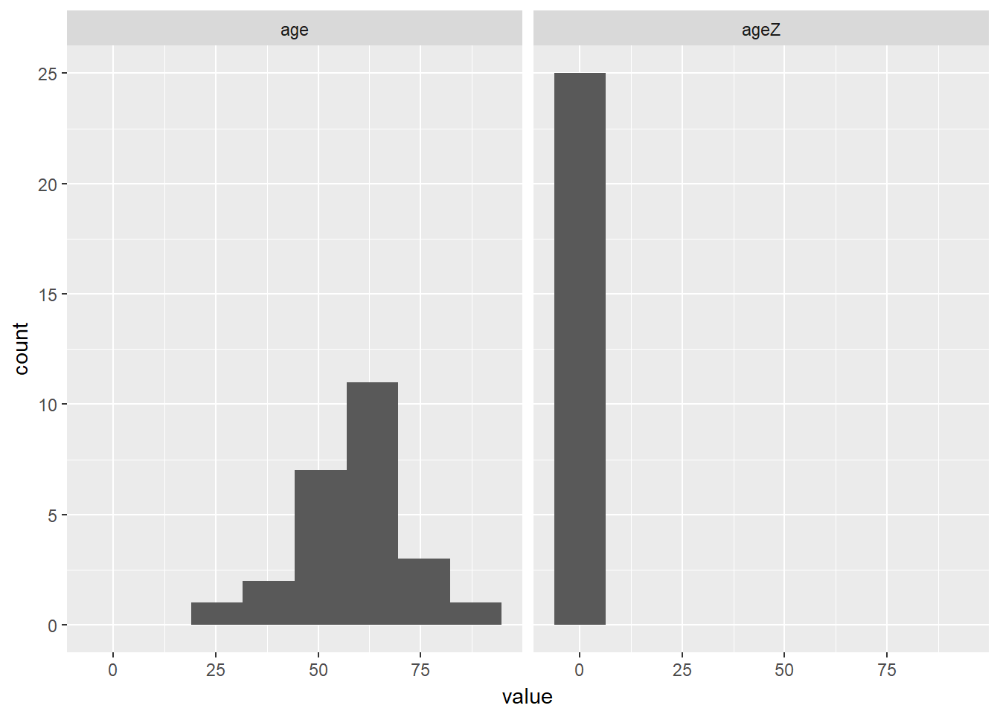
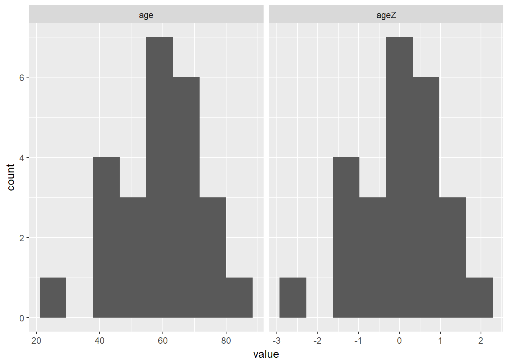

# STANDARDIZING SCORES

**Chapter Links**

* [Chapter 4 Slide Show](http://tysonbarrett.com/EDUC-6600/Slides/01_Ch4_Zscores.html#1)

* [Cancer Dataset - SPSS format](https://usu.box.com/s/9c92zof5whb76bphmzxn3vqx5702qgq6)

**Assignment Links**

* [Unit 1 Assignment - Write Up Skeleton](https://usu.box.com/s/bn0m44cp5zrkev3ppjdilfsvic4bubvu)

* [Unit 1 Assignment - Rmd Skeleton](https://usu.box.com/s/zjjwexn827ziifxlcoe6emr2brfifk0x)

* [Inho's Dataset - Excel format](https://usu.box.com/s/hyky7eb24l6vvzj2xboedhcx1xolrpw1)


Required Packages 


```r
library(tidyverse)    # Loads several very helpful 'tidy' packages
library(haven)        # Read in SPSS datasets
library(furniture)    # Nice tables (by our own Tyson Barrett)
```


Example: Cancer Experiment 

The `Cancer` dataset was introduced in [chapter 3][Example: Cancer Experiment].


## Standardize Variables - Manually

You can manually create a stadradized version of the `age` variable.


First, you must find the **mean** and **standard deviation** of the `age` variable.


```r
cancer_clean %>%
  furniture::table1(age)
```

```

-----------------------
     Mean/Count (SD/%)
     n = 25           
 age                  
     59.6 (12.9)      
-----------------------
```


Second, write an equation to do the calculation.


```r
cancer_clean %>%
  dplyr::mutate(agez = (age - 59.6) / 12.9) %>% 
  dplyr::select(id, trt, age, agez)
```

```
# A tibble: 25 x 4
   id    trt       age    agez
   <fct> <fct>   <dbl>   <dbl>
 1 1     Placebo  52.0 -0.589 
 2 5     Placebo  77.0  1.35  
 3 6     Placebo  60.0  0.0310
 4 9     Placebo  61.0  0.109 
 5 11    Placebo  59.0 -0.0465
 6 15    Placebo  69.0  0.729 
 7 21    Placebo  67.0  0.574 
 8 26    Placebo  56.0 -0.279 
 9 31    Placebo  61.0  0.109 
10 35    Placebo  51.0 -0.667 
# ... with 15 more rows
```


## Standardize Variables - with the `scale()` funciton

A quicker way is to use a funciton.  Notice the differences due to rounding.


```r
cancer_new <- cancer_clean %>%
  dplyr::mutate(agez = (age - 59.6) / 12.9) %>% 
  dplyr::mutate(ageZ = scale(age))%>%
  dplyr::select(id, trt, age, agez, ageZ)

cancer_new
```

```
# A tibble: 25 x 5
   id    trt       age    agez    ageZ
   <fct> <fct>   <dbl>   <dbl>   <dbl>
 1 1     Placebo  52.0 -0.589  -0.591 
 2 5     Placebo  77.0  1.35    1.34  
 3 6     Placebo  60.0  0.0310  0.0278
 4 9     Placebo  61.0  0.109   0.105 
 5 11    Placebo  59.0 -0.0465 -0.0495
 6 15    Placebo  69.0  0.729   0.724 
 7 21    Placebo  67.0  0.574   0.569 
 8 26    Placebo  56.0 -0.279  -0.281 
 9 31    Placebo  61.0  0.109   0.105 
10 35    Placebo  51.0 -0.667  -0.668 
# ... with 15 more rows
```

You can check that the new variable does in deed have mean of zero and spread of one.


```r
cancer_new %>% 
  furniture::table1(age, agez, ageZ,
                    digits = 8)
```

```

--------------------------------
      Mean/Count (SD/%)        
      n = 25                   
 age                           
      59.64000000 (12.93213053)
 agez                          
      0.00310078 (1.00249074)  
 ageZ                          
      -0.00000000 (1.00000000) 
--------------------------------
```


Both the mean and the standard deviation are different.


```r
cancer_new %>% 
  tidyr::gather(key = "variable",
                value = "value",
                age, ageZ) %>% 
  ggplot(aes(value)) +
  geom_histogram(bins = 8) +
  facet_grid(. ~ variable)
```



However, if you let the scale of the x-axis change, you see the shape of the two variables is identical.


```r
cancer_new %>% 
  tidyr::gather(key = "variable",
                value = "value",
                age, ageZ) %>% 
  ggplot(aes(value)) +
  geom_histogram(bins = 8) +
  facet_grid(. ~ variable, scale = "free_x")
```




