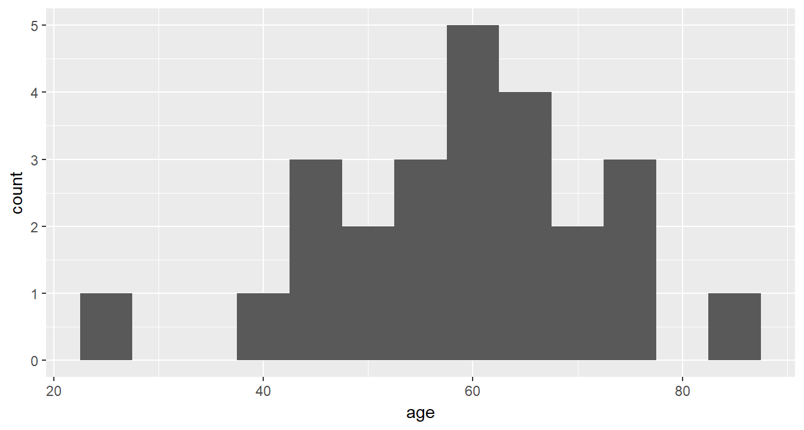
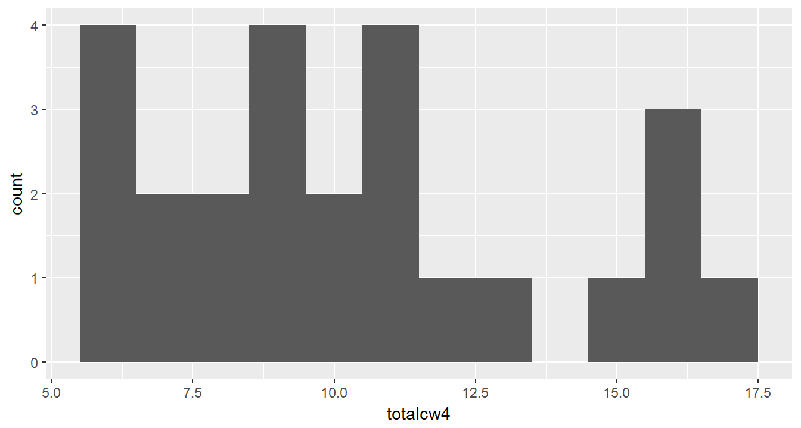
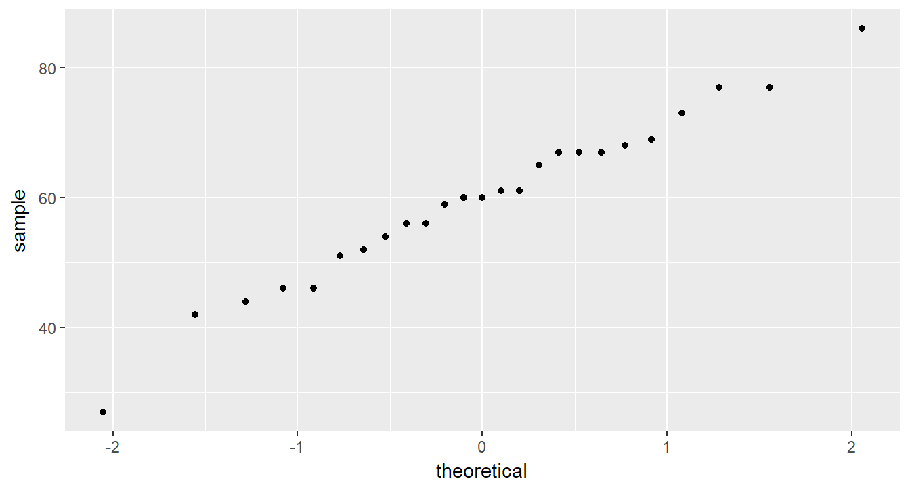

# TESTING NORMALITY

**Chapter Links**

* [Chapter 5 Slide Show](http://tysonbarrett.com/EDUC-6600/Slides/01_Ch5_HypoTest.html#1)

* [Cancer Dataset - SPSS format](https://usu.box.com/s/9c92zof5whb76bphmzxn3vqx5702qgq6)

**Assignment Links**

* [Unit 2 Assignment - Write Up Skeleton](https://usu.box.com/s/mr5ersj8oqu6mj3tyup697ljg2527p8h)

* [Unit 2 Assignment - Rmd Skeleton](https://usu.box.com/s/85s7t82tih6f06v8bpvjo0qt275gafsr)

* [Inho's Dataset - Excel format](https://usu.box.com/s/hyky7eb24l6vvzj2xboedhcx1xolrpw1)


Required Packages 


```r
library(tidyverse)    # Loads several very helpful 'tidy' packages
library(haven)        # Read in SPSS datasets
library(psych)        # Lots of nice tid-bits
```


Example: Cancer Experiment 

The `Cancer` dataset was introduced in [chapter 3][Example: Cancer Experiment].


## Skewness & Kurtosis

The `psych::describe()` function may be used to calculate skewness and kurtosis.


```r
cancer_clean %>% 
  dplyr::select(age, totalcw4) %>% 
  psych::describe()
```

```
         vars  n  mean    sd median trimmed   mad min max range  skew
age         1 25 59.64 12.93     60   59.95 11.86  27  86    59 -0.31
totalcw4    2 25 10.36  3.47     10   10.19  2.97   6  17    11  0.49
         kurtosis   se
age         -0.01 2.59
totalcw4    -1.00 0.69
```


## Shapiro-Wilk's Test

The `shapiro.test()` function is used to test for normality in a small'ish sample.  This function is meant to be applied to a single variable in vector form, thus precede it with a `dplyr::pull()` step.

> If $p-value \gt \alpha$, then the sample does **NOT** provide evidence the population is non-normally distributed.


```r
cancer_clean %>% 
  dplyr::pull(age) %>% 
  shapiro.test()
```

```

	Shapiro-Wilk normality test

data:  .
W = 0.98317, p-value = 0.9399
```

> If $p-value \lt \alpha$, then the sample **DOES** provide evidence the population is non-normally distributed.


```r
cancer_clean %>% 
  dplyr::pull(totalcw4) %>% 
  shapiro.test()
```

```

	Shapiro-Wilk normality test

data:  .
W = 0.9131, p-value = 0.03575
```


## Histogram

Histograms provide a visual way to determine if a data are approximately normally distributed.  Look for a 'bell' shape.


```r
cancer_clean %>% 
  ggplot(aes(age)) +
  geom_histogram(binwidth = 5)
```




```r
cancer_clean %>% 
  ggplot(aes(totalcw4)) +
  geom_histogram(binwidth = 1)
```




## Q-Q Plot

Quantile-quantile plots also help visually determine if data are approximately normally distributed.  Look for the points to fall on a straight $45 \degree$ line.


```r
cancer_clean %>% 
  ggplot(aes(sample = age)) +
  geom_qq()
```




```r
cancer_clean %>% 
  ggplot(aes(sample = totalcw4)) +
  geom_qq()
```


