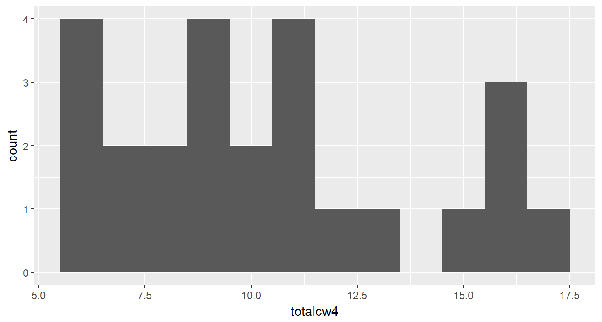
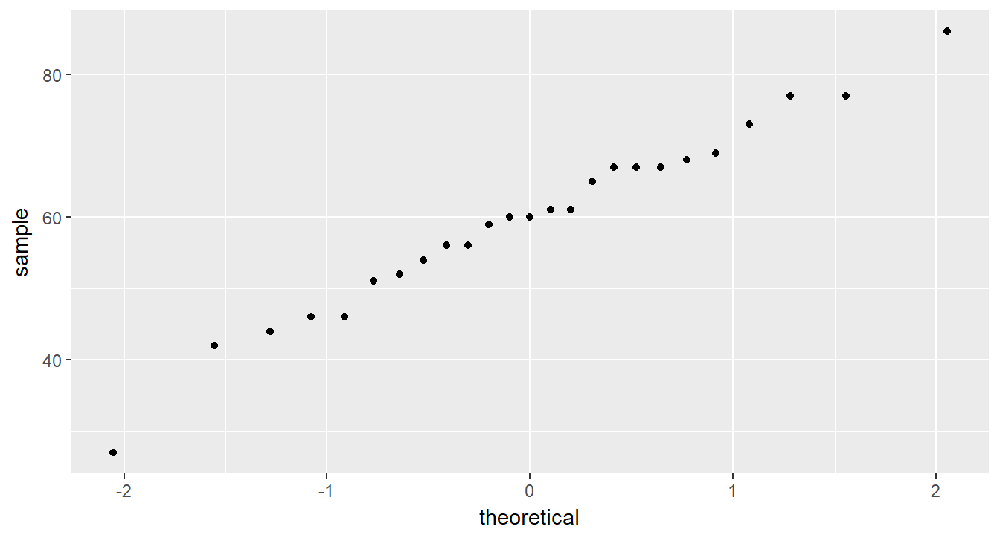
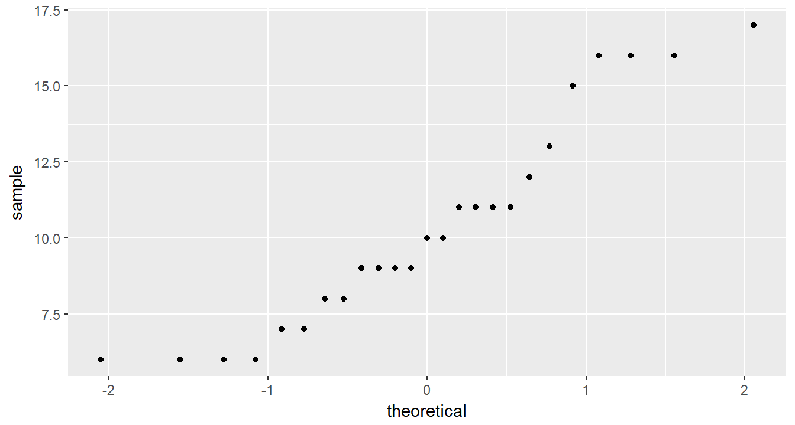

# TESTING NORMALITY

**Chapter Links**

* [Chapter 5 Slide Show](http://tysonbarrett.com/EDUC-6600/Slides/01_Ch5_HypoTest.html#1)

* [Cancer Dataset - SPSS format](https://usu.box.com/s/9c92zof5whb76bphmzxn3vqx5702qgq6)

**Assignment Links**

* [Unit 2 Assignment - Write Up Skeleton](https://usu.box.com/s/bn0m44cp5zrkev3ppjdilfsvic4bubvu)

* [Unit 2 Assignment - Rmd Skeleton](https://usu.box.com/s/zjjwexn827ziifxlcoe6emr2brfifk0x)

* [Inho's Dataset - Excel format](https://usu.box.com/s/hyky7eb24l6vvzj2xboedhcx1xolrpw1)


## Example: Cancer Experiment {-}

see chapter 3


### Required Packages {-}


```r
library(tidyverse)    # Loads several very helpful 'tidy' packages
library(haven)        # Read in SPSS datasets
library(furniture)    # Nice tables (by our own Tyson Barrett)
library(psych)        # Lots of nice tid-bits
```

### Data Import {-}

The `Cancer` dataset is saved in SPSS format, which is evident from the `.sav` ending on the file name.

The `haven` package is downloaded as part of the `tidyverse` set of packages, but is not automatically loaded.  It must have its own `library()` function call *(see above)*.  The `haven::read_spss()` function works very simarly to the `readxl::read_excel()` function we used last chapter [@R-haven].

* Make sure the **dataset** is saved in the same *folder* as this file
* Make sure the that *folder* is the **working directory**


```r
cancer_raw <- haven::read_spss("cancer.sav")
```


```r
tibble::glimpse(cancer_raw)
```

```
Observations: 25
Variables: 9
$ ID       <dbl> 1, 5, 6, 9, 11, 15, 21, 26, 31, 35, 39, 41, 45, 2, 12...
$ TRT      <dbl> 0, 0, 0, 0, 0, 0, 0, 0, 0, 0, 0, 0, 0, 0, 1, 1, 1, 1,...
$ AGE      <dbl> 52, 77, 60, 61, 59, 69, 67, 56, 61, 51, 46, 65, 67, 4...
$ WEIGHIN  <dbl> 124.0, 160.0, 136.5, 179.6, 175.8, 167.6, 186.0, 158....
$ STAGE    <dbl> 2, 1, 4, 1, 2, 1, 1, 3, 1, 1, 4, 1, 1, 2, 4, 1, 2, 1,...
$ TOTALCIN <dbl> 6, 9, 7, 6, 6, 6, 6, 6, 6, 6, 7, 6, 8, 7, 6, 4, 6, 6,...
$ TOTALCW2 <dbl> 6, 6, 9, 7, 7, 6, 11, 11, 9, 4, 8, 6, 8, 16, 10, 6, 1...
$ TOTALCW4 <dbl> 6, 10, 17, 9, 16, 6, 11, 15, 6, 8, 11, 9, 9, 9, 11, 8...
$ TOTALCW6 <dbl> 7, 9, 19, 3, 13, 11, 10, 15, 8, 7, 11, 6, 10, 10, 9, ...
```


### Data Wrangling {-}


```r
cancer_clean <- cancer_raw %>% 
  dplyr::rename_all(tolower) %>% 
  dplyr::mutate(id = factor(id)) %>% 
  dplyr::mutate(trt = factor(trt,
                             labels = c("Placebo", 
                                        "Aloe Juice"))) %>% 
  dplyr::mutate(stage = factor(stage))

tibble::glimpse(cancer_clean)
```

```
Observations: 25
Variables: 9
$ id       <fct> 1, 5, 6, 9, 11, 15, 21, 26, 31, 35, 39, 41, 45, 2, 12...
$ trt      <fct> Placebo, Placebo, Placebo, Placebo, Placebo, Placebo,...
$ age      <dbl> 52, 77, 60, 61, 59, 69, 67, 56, 61, 51, 46, 65, 67, 4...
$ weighin  <dbl> 124.0, 160.0, 136.5, 179.6, 175.8, 167.6, 186.0, 158....
$ stage    <fct> 2, 1, 4, 1, 2, 1, 1, 3, 1, 1, 4, 1, 1, 2, 4, 1, 2, 1,...
$ totalcin <dbl> 6, 9, 7, 6, 6, 6, 6, 6, 6, 6, 7, 6, 8, 7, 6, 4, 6, 6,...
$ totalcw2 <dbl> 6, 6, 9, 7, 7, 6, 11, 11, 9, 4, 8, 6, 8, 16, 10, 6, 1...
$ totalcw4 <dbl> 6, 10, 17, 9, 16, 6, 11, 15, 6, 8, 11, 9, 9, 9, 11, 8...
$ totalcw6 <dbl> 7, 9, 19, 3, 13, 11, 10, 15, 8, 7, 11, 6, 10, 10, 9, ...
```


---------------------------------------

## Skewness & Kurtosis

The `psych::describe()` function may be used to calculate skewness and kurtosis.


```r
cancer_clean %>% 
  dplyr::select(age, totalcw4) %>% 
  psych::describe()
```

```
         vars  n  mean    sd median trimmed   mad min max range  skew
age         1 25 59.64 12.93     60   59.95 11.86  27  86    59 -0.31
totalcw4    2 25 10.36  3.47     10   10.19  2.97   6  17    11  0.49
         kurtosis   se
age         -0.01 2.59
totalcw4    -1.00 0.69
```


## Shapiro-Wilk's Test

The `shapiro.test()` function is used to test for normality in a small'ish sample.  This function is meant to be applied to a single variable in vector form, thus precede it with a `dplyr::pull()` step.

> If $p-value \gt \alpha$, then the sample does **NOT** provide evidence the population is non-normally distributed.


```r
cancer_clean %>% 
  dplyr::pull(age) %>% 
  shapiro.test()
```

```

	Shapiro-Wilk normality test

data:  .
W = 0.98317, p-value = 0.9399
```

> If $p-value \lt \alpha$, then the sample **DOES** provide evidence the population is non-normally distributed.


```r
cancer_clean %>% 
  dplyr::pull(totalcw4) %>% 
  shapiro.test()
```

```

	Shapiro-Wilk normality test

data:  .
W = 0.9131, p-value = 0.03575
```


## Histogram

Histograms provide a visual way to determine if a data are approximately normally distributed.  Look for a 'bell' shape.


```r
cancer_clean %>% 
  ggplot(aes(age)) +
  geom_histogram(binwidth = 5)
```


```r
cancer_clean %>% 
  ggplot(aes(totalcw4)) +
  geom_histogram(binwidth = 1)
```




## Q-Q Plot

Quantile-quantile plots also help visually determine if data are approximately normally distributed.  Look for the points to fall on a straight $45 \degree$ line.


```r
cancer_clean %>% 
  ggplot(aes(sample = age)) +
  geom_qq()
```




```r
cancer_clean %>% 
  ggplot(aes(sample = totalcw4)) +
  geom_qq()
```




