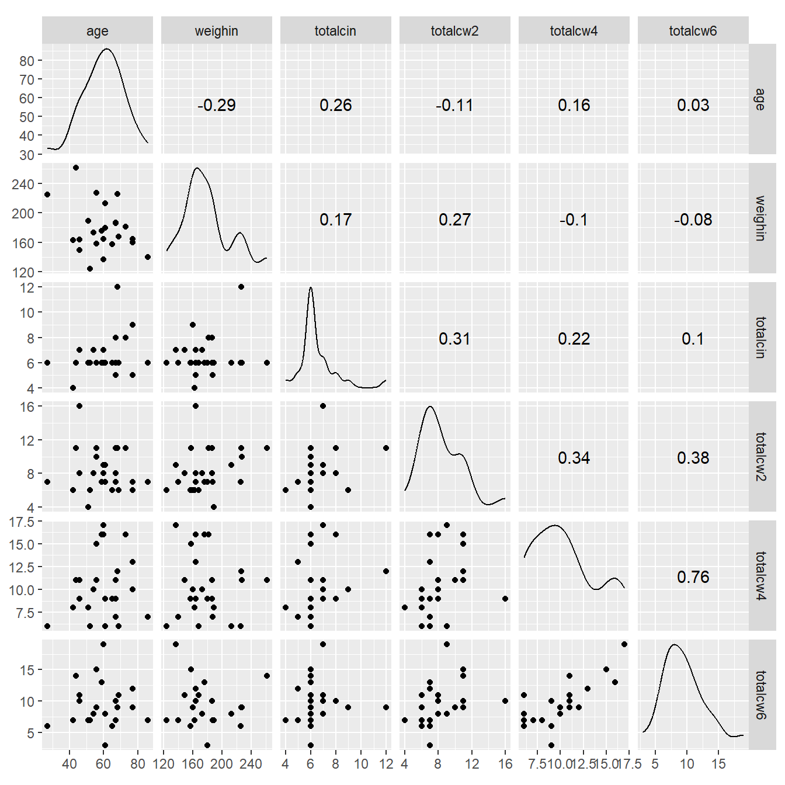
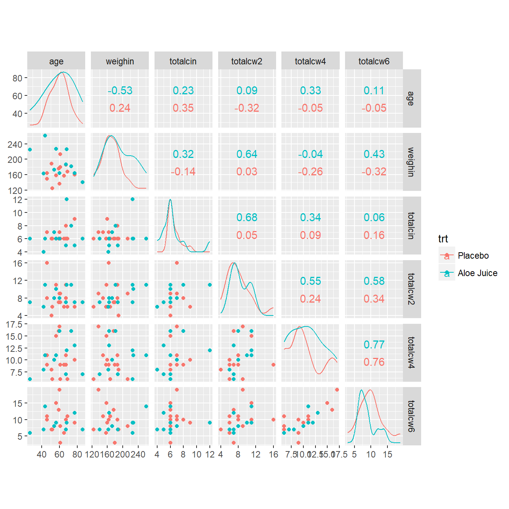
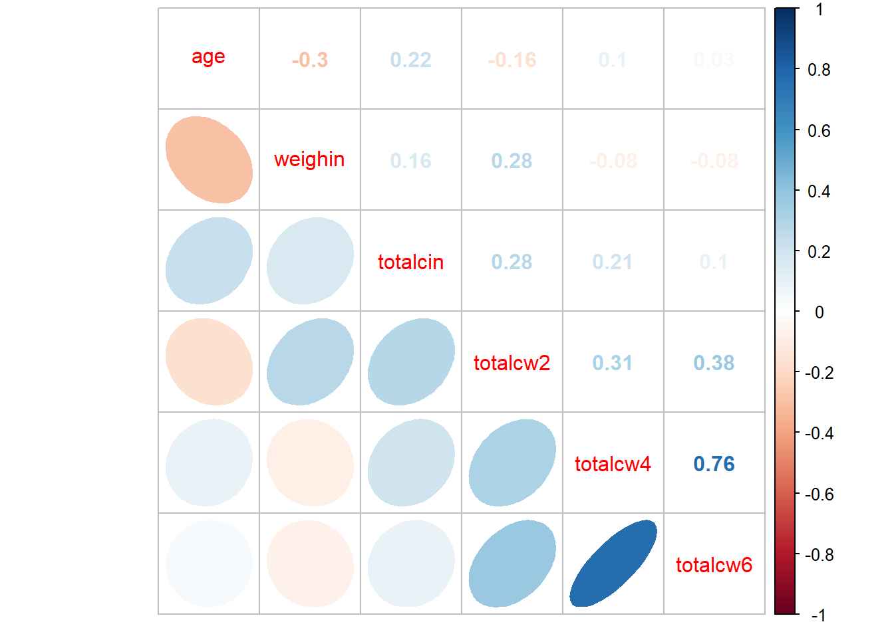

# Linear Correlation

**Chapter Links**

* [Chapter 9 Slide Show](http://tysonbarrett.com/EDUC-6600/Slides/u03_Ch9_Cor.html#1)

* [Interactive Online App - Correlation and Regression](http://digitalfirst.bfwpub.com/stats_applet/stats_applet_5_correg.html)

* [Cancer Dataset - SPSS format](https://usu.box.com/s/9c92zof5whb76bphmzxn3vqx5702qgq6)


**Unit Assignment Links**

* Unit 3 Writen Part: [Skeleton - pdf](https://usu.box.com/s/vjcsotiqwu1mwnwgzbfyig6k451ymgow)

* Unit 3 R Part: [Directions - pdf](https://usu.box.com/s/ectr9zx8qfbbm59h0qcexjreje5r9aio) and [Skeleton - Rmd](https://usu.box.com/s/k3vzw6nuq5tw66bxeptcyzth38pj69f9)

* Unit 3 Reading to Summarize: [Article - pdf](https://usu.box.com/s/qmo57s03tbq02ks75p7eb5gad0ap05kg)

* Inho's Dataset: [Excel](https://usu.box.com/s/hyky7eb24l6vvzj2xboedhcx1xolrpw1)


Required Packages 


```r
library(tidyverse)    # Loads several very helpful 'tidy' packages
library(haven)        # Read in SPSS datasets
library(psych)        # Lots of nice tid-bits
library(GGally)       # Extension to 'ggplot2' (ggpairs)
```


Example: Cancer Experiment 

The `Cancer` dataset was introduced in [chapter 3][Example: Cancer Experiment].


-------------------------------------------------------


## Visualize the Raw Data

Always plot your data first!


```r
cancer_clean %>% 
  ggplot(aes(x = age,
             y = weighin)) +
  geom_point() +
  geom_smooth(method = "lm")
```


-------------------------------------------------------


## Pearson's Correlation Coefficient


The `cor.test()` function needs at least TWO arguments:

* **formula** - The formula specifies the two variabels between which you would like to calcuate the correlation.  Note at the two variable names come AFTER the tilda symbol and are separated with a plus sign: `~ continuous_var1 + continuous_var2`

* **data** - Since the datset is not the first argument in the function, you must use the period to signify that the datset is being piped from above `data = .` 


```r
cancer_clean %>% 
  cor.test(~ age + weighin,  # formula: order doesn't matter
           data = .)         # data piped from above
```

```

	Pearson's product-moment correlation

data:  age and weighin
t = -1.4401, df = 23, p-value = 0.1633
alternative hypothesis: true correlation is not equal to 0
95 percent confidence interval:
 -0.6130537  0.1213316
sample estimates:
       cor 
-0.2875868 
```


-------------------------------------------------------

### Additional Arguments


* **alternative**  - The `cor.test()` function defaults to the `alternative = "two.sided"`.  If you would like a one-sided alternative, you must choose which side you would like to test:  `alternative = "greater"` to test for POSITIVE correlation or `alternative = "less"` to test for NEGATIVE correlation.

* **method** - The default is to calculate the Pearson correlation coefficient (`method = "pearson"`), but you may also specify the Kendall's tau (`method = "kendall"`)or Spearman's rho (`method = "spearman"`), which are both non-parametric methods.  

* **conf.int** - It also defaults to testing for the two-sided alternative and computing a 95\% confidence interval (`conf.level = 0.95`), but this may be changed.  


Since the following code only specifies the**defaults**, it Will give the same results as if you did not type out the last three lines (see above).


```r
cancer_clean %>% 
  cor.test(~ age + weighin,
           data = .,
           alternative = "two.sided",  # or "greater" (positive r) or "less" (negative r)
           method = "pearson",          # or "kendall" (tau) or "spearman" (rho)
           conf.level = .95)            # or .90 or .99 (ect)
```

```

	Pearson's product-moment correlation

data:  age and weighin
t = -1.4401, df = 23, p-value = 0.1633
alternative hypothesis: true correlation is not equal to 0
95 percent confidence interval:
 -0.6130537  0.1213316
sample estimates:
       cor 
-0.2875868 
```


-------------------------------------------------------


### Statistical Significance

**Non-Significant Correlation**

> **APA Results:** There was no evidence of an association in overall oral condition from baseline to two week follow-up, $r(25) = -0.288 $p < .163$.


```r
cancer_clean %>% 
  ggplot(aes(x = totalcin,
             y = totalcw4)) +
  geom_point() +
  geom_smooth(method = "lm")
```


```r
cancer_clean %>% 
  cor.test(~ totalcin + totalcw4,
           data = .)
```

```

	Pearson's product-moment correlation

data:  totalcin and totalcw4
t = 1.0911, df = 23, p-value = 0.2865
alternative hypothesis: true correlation is not equal to 0
95 percent confidence interval:
 -0.1899343  0.5672525
sample estimates:
      cor 
0.2218459 
```


**Statistically Significant Correlation**

> **APA Results:** Overall oral condition was positively correlated ($r = .763$) between weeks two and four, $t(21) = 5.409$, $p < .001$.


```r
cancer_clean %>% 
  ggplot(aes(x = totalcw4,
             y = totalcw6)) +
  geom_point() +
  geom_smooth(method = "lm")
```


```r
cancer_clean %>% 
  cor.test(~ totalcw4 + totalcw6,
           data = .)
```

```

	Pearson's product-moment correlation

data:  totalcw4 and totalcw6
t = 5.4092, df = 21, p-value = 2.296e-05
alternative hypothesis: true correlation is not equal to 0
95 percent confidence interval:
 0.5117459 0.8940223
sample estimates:
     cor 
0.762999 
```


-------------------------------------------------------


## Correlation Tables

The may use the `tableC()` function from the `furniture` package to calculate all pair-wise correlations between more than two variables and arrange them all in a table.  The table is formatted with the variabels listed on the rows and numbered to show the same variabels across the columns. 

* The cells ON the diagonal are all equal to *exactly one*, since each variable is perfectly correlated with itself.

* The cells ABOVE the diagonal are *blank* as them would just be a mirror image of the values below the diagonal. 

* The cells BELOW the diagonal each contain the *Pearson's correlation coefficients* for each pair of variables, $r$, with the $p-value$ showing the significance vs. the null hypothesis for no association ($r = 0$) to the right.


```r
cancer_clean %>% 
  furniture::tableC(age, weighin, totalcin)
```

```

-----------------------------------------------
             [1]            [2]          [3]  
 [1]age      1.00                             
 [2]weighin  -0.288 (0.163) 1.00              
 [3]totalcin 0.256 (0.217)  0.17 (0.418) 1.00 
-----------------------------------------------
```

-------------------------------------------------------

### Missing Values - Default

**Default Behavior `na.rm = FALSE` (default)**

If you don't say otherwise, the correlation $r$ with not be calculated (`NA`) between any pair of variables for which there is at least one subject with a missing value on at least one of the vairables.  This is a nice alert to make you aware of missing values.


```r
cancer_clean %>% 
  furniture::tableC(totalcin, totalcw2, totalcw4, totalcw6)
```

```

-----------------------------------------------------
             [1]           [2]           [3]   [4]  
 [1]totalcin 1.00                                   
 [2]totalcw2 0.314 (0.126) 1.00                     
 [3]totalcw4 0.222 (0.287) 0.337 (0.099) 1.00       
 [4]totalcw6 NA NA         NA NA         NA NA 1.00 
-----------------------------------------------------
```


-------------------------------------------------------

### Missing Values - Listwise Deletion


**Listwise Deletion `na.rm = TRUE`**

Most of the time you will want to compute the correlation $r$ is the precense of missing values.  To do so, you want to remove or exclude subjects with missing data from ALL correlation computation in the table.  This is called **'list-wise deletion'**.  It ensures that all cells in the table refer to the exact same sub-sample (n = subjects with complete data for all variables in the table), and thus the same degrees of freedom (since $df = n - 2$).  This is done be changing the default to `na.rm = TRUE`.


```r
cancer_clean %>% 
  furniture::tableC(totalcin, totalcw2, totalcw4, totalcw6,
                    na.rm = TRUE)
```

```

-------------------------------------------------------------
             [1]           [2]           [3]           [4]  
 [1]totalcin 1.00                                           
 [2]totalcw2 0.282 (0.192) 1.00                             
 [3]totalcw4 0.206 (0.346) 0.314 (0.145) 1.00               
 [4]totalcw6 0.098 (0.657) 0.378 (0.075) 0.763 (<.001) 1.00 
-------------------------------------------------------------
```


-------------------------------------------------------


## Pairs Plots

* [Helpful Website](http://jamesmarquezportfolio.com/correlation_matrices_in_r.html)


-------------------------------------------------------

### Base R


```r
cancer_clean %>% 
  dplyr::select(age, weighin, 
                totalcin, totalcw2, totalcw4, totalcw6) %>% 
  pairs()
```


-------------------------------------------------------

### `psych` package


```r
cancer_clean %>% 
  dplyr::select(age, weighin,
                totalcin, totalcw2, totalcw4, totalcw6) %>% 
  psych::pairs.panels()
```


-------------------------------------------------------

### `ggplot2` and `GGally` packages


```r
cancer_clean %>% 
  dplyr::select(age, weighin,
                totalcin, totalcw2, totalcw4, totalcw6) %>% 
  data.frame %>% 
  ggscatmat()
```




```r
cancer_clean %>% 
  data.frame %>% 
  ggscatmat(columns = c("age", "weighin",
                        "totalcin", "totalcw2", "totalcw4", "totalcw6"),
            color = "trt")
```




-------------------------------------------------------


## Correlation Plots: Corrolagrams


```r
cancer_clean %>% 
  dplyr::select(age, weighin, 
                totalcin, totalcw2, totalcw4, totalcw6) %>% 
  cor(method = "pearson",
      use = "complete.obs") 
```

```
                 age     weighin   totalcin   totalcw2    totalcw4
age       1.00000000 -0.29909121 0.22386540 -0.1613892  0.09918029
weighin  -0.29909121  1.00000000 0.16403694  0.2763478 -0.08013506
totalcin  0.22386540  0.16403694 1.00000000  0.2819648  0.20604650
totalcw2 -0.16138924  0.27634783 0.28196479  1.0000000  0.31354250
totalcw4  0.09918029 -0.08013506 0.20604650  0.3135425  1.00000000
totalcw6  0.03015273 -0.07750304 0.09786664  0.3780949  0.76299899
            totalcw6
age       0.03015273
weighin  -0.07750304
totalcin  0.09786664
totalcw2  0.37809488
totalcw4  0.76299899
totalcw6  1.00000000
```


```r
cancer_clean %>% 
  dplyr::select(age, weighin, 
                totalcin, totalcw2, totalcw4, totalcw6) %>% 
  cor(method = "pearson",
      use = "complete.obs") %>% 
  corrplot::corrplot()
```


```r
cancer_clean %>% 
  dplyr::select(age, weighin, 
                totalcin, totalcw2, totalcw4, totalcw6) %>% 
  cor(method = "pearson",
      use = "complete.obs") %>% 
  corrplot::corrplot(method = "square")
```


```r
cancer_clean %>% 
  dplyr::select(age, weighin, 
                totalcin, totalcw2, totalcw4, totalcw6) %>% 
  cor(method = "pearson",
      use = "complete.obs") %>% 
  corrplot::corrplot(method = "ellipse",
                     type = "lower")
```


```r
cancer_clean %>% 
  dplyr::select(age, weighin, 
                totalcin, totalcw2, totalcw4, totalcw6) %>% 
  cor(method = "pearson",
      use = "complete.obs") %>% 
  corrplot::corrplot.mixed()
```


```r
cancer_clean %>% 
  dplyr::select(age, weighin, 
                totalcin, totalcw2, totalcw4, totalcw6) %>% 
  cor(method = "pearson",
      use = "complete.obs") %>% 
  corrplot::corrplot.mixed(upper = "number",
                           lower = "ellipse")
```



