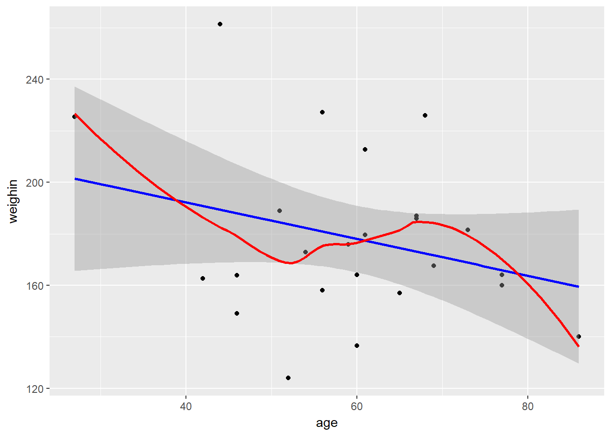
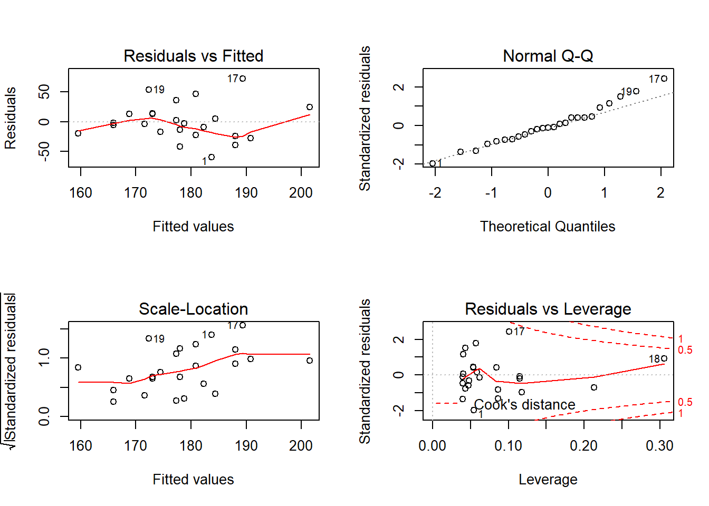

# Linear Regression

**Chapter Links**

* [Chapter 10 Slide Show](http://tysonbarrett.com/EDUC-6600/Slides/u03_Ch10_LinReg.html#1)

* [Interactive Online App - Correlation and Regression](http://digitalfirst.bfwpub.com/stats_applet/stats_applet_5_correg.html)

* [Cancer Dataset - SPSS format](https://usu.box.com/s/9c92zof5whb76bphmzxn3vqx5702qgq6)


**Unit Assignment Links**

* Unit 3 Writen Part: [Skeleton - pdf](https://usu.box.com/s/vjcsotiqwu1mwnwgzbfyig6k451ymgow)

* Unit 3 R Part: [Directions - pdf](https://usu.box.com/s/ectr9zx8qfbbm59h0qcexjreje5r9aio) and [Skeleton - Rmd](https://usu.box.com/s/k3vzw6nuq5tw66bxeptcyzth38pj69f9)

* Unit 3 Reading to Summarize: [Article - pdf](https://usu.box.com/s/qmo57s03tbq02ks75p7eb5gad0ap05kg)

* Inho's Dataset: [Excel](https://usu.box.com/s/hyky7eb24l6vvzj2xboedhcx1xolrpw1)

**Related Readings**

* [Linear Regression - Walkthrough in R](https://uc-r.github.io/linear_regression)

* [Standard Error of the Regression vs. R-squared](http://statisticsbyjim.com/regression/standard-error-regression-vs-r-squared/)


Required Packages 


```r
library(tidyverse)    # Loads several very helpful 'tidy' packages
library(haven)        # Read in SPSS datasets
library(car)          # Companion for Applied Regression (and ANOVA)
library(broom)        # Convert STatistical Analysis Objects into Tidy Dataframes
library(magrittr)     # A Forward-Pipe Operator for R
```


Example: Cancer Experiment 

The `Cancer` dataset was introduced in [chapter 3][Example: Cancer Experiment].


-------------------------------------------------------


## Visualize the Raw Data

Always plot your data first!


```r
cancer_clean %>% 
  ggplot(aes(x = age,
             y = weighin)) +
  geom_point() +
  geom_smooth(method = "lm",    se = TRUE, color = "blue") +  # straight line (linear model)
  geom_smooth(method = "loess", se = FALSE, color = "red")   # loess line (moving window)
```



-------------------------------------------------------


## Fitting a Simple Regression Model


The `lm()` function needs at least TWO arguments:

* **formula** - The name of the *outcome* or dependent variable (DV) goes on the left of the tilda symbol and the name of the *predictor* or independent variable (IV) comes after: `continuous_y ~ continuous_x`

* **data** - Since the datset is not the first argument in the function, you must use the period to signify that the datset is being piped from above `data = .` 


```r
cancer_clean %>% 
  lm(weighin ~ age,    # formula: order DOES matter
     data = .)         # data piped from above
```

```

Call:
lm(formula = weighin ~ age, data = .)

Coefficients:
(Intercept)          age  
   220.6899      -0.7111  
```

-------------------------------------------------------


## Extracting Information From the Model

### Model Overview


To view more complete information, add a `summary()` step using a pipe AFTER the `lm()` step


```r
cancer_clean %>% 
  lm(weighin ~ age,    # formula: order DOES matter
     data = .) %>%     # data piped from above
  summary()
```

```

Call:
lm(formula = weighin ~ age, data = .)

Residuals:
    Min      1Q  Median      3Q     Max 
-59.713 -19.535  -2.935  12.954  71.998 

Coefficients:
            Estimate Std. Error t value Pr(>|t|)    
(Intercept) 220.6899    30.1076    7.33 1.86e-07 ***
age          -0.7111     0.4938   -1.44    0.163    
---
Signif. codes:  0 '***' 0.001 '**' 0.01 '*' 0.05 '.' 0.1 ' ' 1

Residual standard error: 31.28 on 23 degrees of freedom
Multiple R-squared:  0.08271,	Adjusted R-squared:  0.04282 
F-statistic: 2.074 on 1 and 23 DF,  p-value: 0.1633
```

> **NOTE - Variable Designation Matters!**

In simple linear regression (with only one predictor DV), the slope estimate ($\hat{\beta_1}$) is different depending on the designation of $x$ and $y$ (two ordering), but the $p-values$ are the same.


```r
cancer_clean %>% 
  lm(age ~ weighin,    # formula: order DOES matter
     data = .) %>%     # data piped from above
  summary()
```

```

Call:
lm(formula = age ~ weighin, data = .)

Residuals:
    Min      1Q  Median      3Q     Max 
-27.160  -6.277   1.514   8.258  21.908 

Coefficients:
            Estimate Std. Error t value Pr(>|t|)    
(Intercept) 80.37531   14.61964   5.498 1.37e-05 ***
weighin     -0.11631    0.08077  -1.440    0.163    
---
Signif. codes:  0 '***' 0.001 '**' 0.01 '*' 0.05 '.' 0.1 ' ' 1

Residual standard error: 12.65 on 23 degrees of freedom
Multiple R-squared:  0.08271,	Adjusted R-squared:  0.04282 
F-statistic: 2.074 on 1 and 23 DF,  p-value: 0.1633
```

----------------------------

### Model Fit or Accuracy

One line for the entire model


```r
cancer_clean %>% 
  lm(weighin ~ age,    
     data = .) %>%     
  broom::glance()
```

```
   r.squared adj.r.squared    sigma statistic   p.value df    logLik
1 0.08270615    0.04282381 31.28435  2.073754 0.1633263  2 -120.5091
       AIC      BIC deviance df.residual
1 247.0183 250.6749 22510.34          23
```


-------------------------------------------------------

### Beta Estimates

One line for each parameter, intercept and a slope for each predictor


```r
cancer_clean %>% 
  lm(weighin ~ age,    
     data = .) %>%     
  broom::tidy()
```

```
         term    estimate  std.error statistic      p.value
1 (Intercept) 220.6899336 30.1075690  7.330048 1.859355e-07
2         age  -0.7110988  0.4938003 -1.440053 1.633263e-01
```

----------------------------

### Confidence Intervals


```r
cancer_clean %>% 
  lm(weighin ~ age,    
     data = .) %>%     
  confint()
```

```
                 2.5 %     97.5 %
(Intercept) 158.407682 282.972185
age          -1.732603   0.310405
```


----------------------------

### Predictions, Residuals, ect.

One line for each subject in the original dataset


```r
cancer_clean %>% 
  lm(weighin ~ age,    
     data = .) %>%     
  broom::augment()
```

```
   weighin age  .fitted   .se.fit     .resid       .hat   .sigma
1    124.0  52 183.7128  7.306243 -59.712795 0.05454237 29.18516
2    160.0  77 165.9353 10.612917  -5.935324 0.11508411 31.95915
3    136.5  60 178.0240  6.259394 -41.524004 0.04003229 30.68475
4    179.6  61 177.3129  6.292807   2.287094 0.04046081 31.98358
5    175.8  59 178.7351  6.264845  -2.935103 0.04010205 31.98107
6    167.6  69 171.6241  7.778883  -4.024115 0.06182731 31.97519
7    186.0  67 173.0463  7.235818  12.953687 0.05349597 31.86124
8    158.0  56 180.8684  6.509929 -22.868400 0.04330104 31.59668
9    212.8  61 177.3129  6.292807  35.487094 0.04046081 31.04096
10   189.0  51 184.4239  7.573036   4.576106 0.05859842 31.97164
11   149.0  46 187.9794  9.193178 -38.979388 0.08635295 30.78321
12   157.0  65 174.4685  6.793659 -17.468510 0.04715778 31.75910
13   186.0  67 173.0463  7.235818  12.953687 0.05349597 31.86124
14   163.8  46 187.9794  9.193178 -24.179388 0.08635295 31.52952
15   227.2  56 180.8684  6.509929  46.331600 0.04330104 30.35140
16   162.6  42 190.8238 10.724907 -28.223783 0.11752571 31.33954
17   261.4  44 189.4016  9.939503  71.998414 0.10094276 27.58833
18   225.4  27 201.4903 17.289500  23.909735 0.30542932 31.39722
19   226.0  68 172.3352  7.496013  53.664786 0.05741250 29.73750
20   164.0  77 165.9353 10.612917  -1.935324 0.11508411 31.98444
21   140.0  86 159.5354 14.442288 -19.535435 0.21311688 31.64098
22   181.5  73 168.7797  9.092365  12.720280 0.08446943 31.86163
23   187.0  67 173.0463  7.235818  13.953687 0.05349597 31.84096
24   164.0  60 178.0240  6.259394 -14.024004 0.04003229 31.84155
25   172.8  54 182.2906  6.848710  -9.490597 0.04792514 31.92016
        .cooksd  .std.resid
1  0.1111477213 -1.96299546
2  0.0026449421 -0.20168166
3  0.0382658612 -1.35470223
4  0.0001174338  0.07463210
5  0.0001915486 -0.09575992
6  0.0005811275 -0.13280118
7  0.0051189260  0.42560342
8  0.0126396540 -0.74734486
9  0.0282726125  1.15800921
10 0.0007073659  0.15075841
11 0.0802982601 -1.30352305
12 0.0080972760 -0.57202934
13 0.0051189260  0.42560342
14 0.0308977397 -0.80859119
15 0.0518821825  1.51412796
16 0.0614150890 -0.96036677
17 0.3307213270  2.42718115
18 0.1849026825  0.91704250
19 0.0950731282  1.76685738
20 0.0002812126 -0.06576211
21 0.0671057022 -0.70394852
22 0.0083303463  0.42494545
23 0.0059397751  0.45845919
24 0.0043647273 -0.45752692
25 0.0024328993 -0.31090731
```


-------------------------------------------------------


## Model Diagnostics


### Base R Graphics


```r
par(mfrow = c(2, 2))

cancer_clean %>% 
  lm(weighin ~ age,    
     data = .) %>%     
  plot()
```



```r
par(mfrow = c(1, 1))
```


