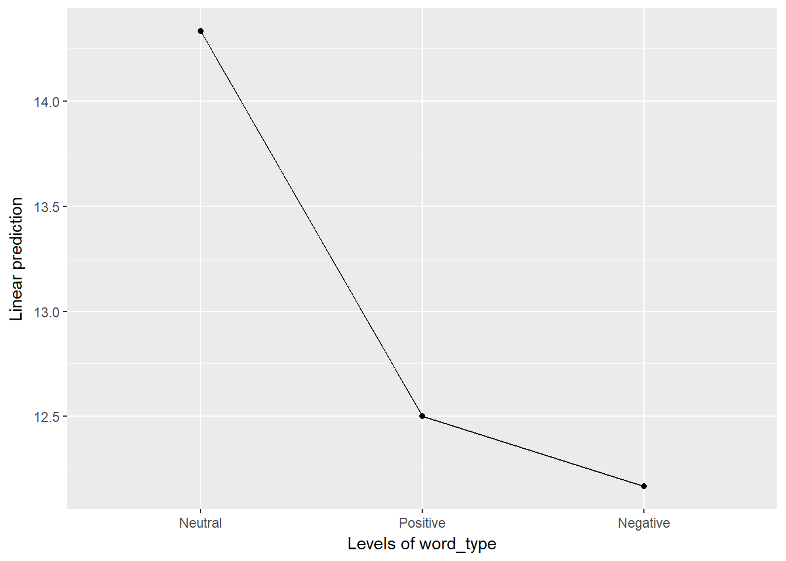
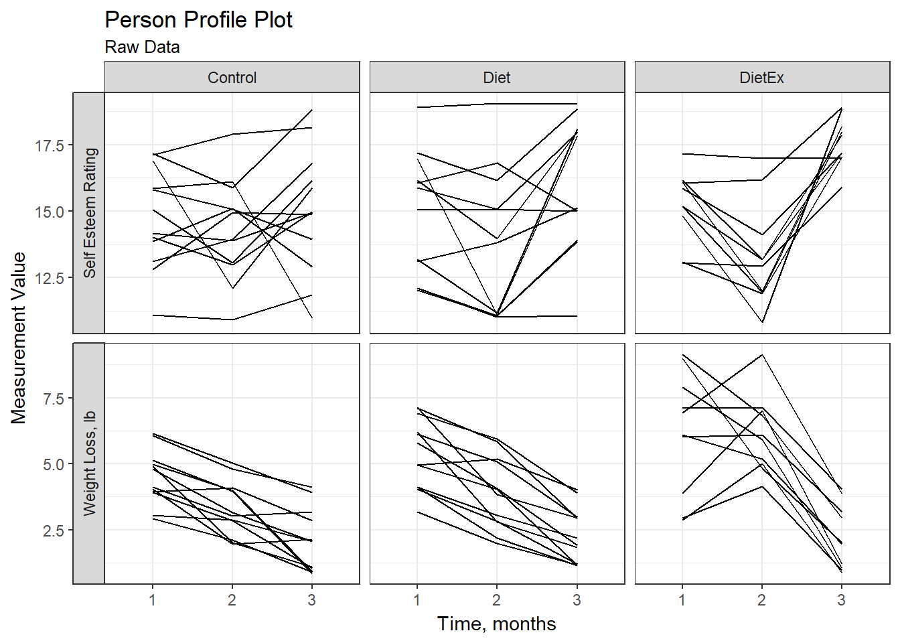
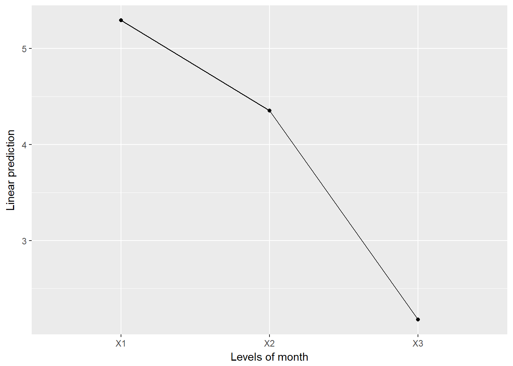

# Repeated Measures ANOVA

**Chapter Links**

* Chapter 15 Slides: [pdf](http://tysonbarrett.com/EDUC-6600/Slides/u05_Ch15_rmANOVA.pdf) or [power point](http://tysonbarrett.com/EDUC-6600/Slides/u05_Ch15_rmANOVA.pptx)


**Unit Assignment Links**

* Unit 5 Writen Part: [Skeleton - pdf](https://usu.box.com/s/rk3cojw85xecankrgeo5fx6pvyc7k5tw)

* Unit 5 R Part: [Directions - pdf](https://usu.box.com/s/boe99auezv2s86lxcrbvtiicrz7yzj7c) and [Skeleton - Rmd](https://usu.box.com/s/k6l1pjyzrt7tqhjq2ptdi2aw8561y1qv)

* Unit 5 Reading to Summarize: [@mongrain2012] [pdf on BOX](https://usu.box.com/s/9jazgd17mn5bnib4jrdg6zb5jtlze3wi) or [online ](https://onlinelibrary.wiley.com/doi/full/10.1002/jclp.21839) 

* Inho's Dataset: [Excel](https://usu.box.com/s/9jazgd17mn5bnib4jrdg6zb5jtlze3wi)


Required Packages 


```r
library(tidyverse)    # Loads several very helpful 'tidy' packages
library(furniture)    # Nice tables (by our own Tyson Barrett)
library(afex)         # needed for ANOVA, emmeans is loaded automatically.
library(multcomp)     # for advanced control for multiple testing/Type 1 error
```


------------------------------------


## Tutorial - Fitting RM ANOVA Models with `afex::aov_4()`

The `aov_4()` function from the `afex` package fits ANOVA models (oneway, two-way, repeated measures, and mixed design). It needs at least two arguments:

1. formula:  `continuous_var ~ 1 + (RM_var|id_var)`  *one observation per subject for each level of the `RMvar`, so each `id_var` has multiple lines for each subject*

2. dataset: `data = .` *we use the period to signify that the datset is being piped from above*


Here is an outline of what your syntax should look like when you **fit and save a RM ANOVA**.  Of course you will replace the dataset name and the variable names, as well as the name you are saving it as.

> **NOTE:** The `aov_4()` function works on data in LONG format only.  Each observation needs to be on its one line or row with seperate variables for the group membership (categorical factor or `fct`) and the continuous measurement (numberic or `dbl`).


```r
# RM ANOVA: fit and save
aov_name <- data_name %>% 
  afex::aov_4(continuous_var ~ 1 + (RM_var|id_var),
              data = .)
```


------------------------------

By running the name you saved you model under, you will get a brief set of output, including a measure of **Effect Size**.

> **NOTE:** The `ges` is the *generalized eta squared*.  In a one-way ANOVA, the eta-squared effect size is the same value, ie. generalized $\eta_g$ and partial $\eta_p$ are the same.


```r
# Display basic ANOVA results (includes effect size)
aov_name 
```

\clearpage


To fully fill out a standard ANOVA table and compute other effect sizes, you will need a more complete set of output, including the **Sum of Squares** components, you will need to add `summary()` piped at the end of the model name before running it or after the model with a pipe.

> **NOTE:** IGNORE the first line that starts with `(Intercept)`!  Also, the 'mean sum of squares' are not included in this table, nor is the **Total** line at the bottom of the standard ANOVA table.  You will need to manually compute these values and add them on the homework page.  Remember that `Sum of Squares (SS)` and `degrees of freedom (df)` add up, but `Mean Sum of Squreas (MS)` do not add up.  Also: `MS = SS/df` for each term.

This also runs and displays the results of Mauchly Tests for Sphericity, as well as the Greenhouse-Geisser (GG) and Huynh-Feldt (HF) Corrections to the p-value.  

> **NOTE:** If the Mauchly's p-value is bigger than .05, do not use the corrections. If Mauchly's p-value is less than .05, then apply the epsilon (`eps` or $\epsilon$) to multiply the degree's of freedom.  Yes, the df will be decimal numbers. 


```r
# Display fuller ANOVA results (sphericity tests)
summary(aov_name)
```

------------------------------


To see all the Sumes-of-Squared residuals for ALL of the model comoponents, you add `$aov` at the end of the model name.  


```r
# Display all the sum of squares
aov_name$aov
```


---------------------------------

Repeated Measures MANOVA Tests (Pillai test statistic) is computed is you add `$Anova` at the end of the model name.  This is a so called 'Multivariate Test'.  **This is NOT what you want to do!**


```r
# Display fuller ANOVA results (includes sum of squares)
aov_name$Anova
```


\clearpage

If you only need to obtain the omnibus (overall) F-test without a correction for violation of sphericity, you can add an option for `correction = "none"`.  You can also request both the generalized and partial $\eta^2$ effect sizes with `es = c("ges", "pes")`.


```r
# RM ANOVA: no correction, both effect sizes
data_name %>% 
  afex::aov_4(continuous_var ~ 1 + (RM_var|id_var),
              data = .,
              anova_table = list(correction = "none",
                                 es = c("ges", "pes")))
```


----------------------------

Post Hoc tests may be ran the same way as the 1 and 2-way ANOVAs from the last unit.

> **NOTE:** Use Fisher's LSD (`adjust = "none"`) if the omnibus F-test is significant AND there are THREE measurements per subject or block.  Tukey's HSD (`adjust = "tukey"`) may be used even if the F-test is not significant or if there are four or more repeated measures. 


```r
# RM ANOVA: post hoc all pairwise tests with Fisher's LSD correction
aov_name %>% 
  emmeans::emmeans(~ RM_var) %>% 
  pairs(adjust = "none")
```


```r
# RM ANOVA: post hoc all pairwise tests with Tukey's HSD correction
aov_name %>% 
  emmeans::emmeans(~ RM_var) %>% 
  pairs(adjust = "tukey")
```


-----------------------

A means plot (model based), can help you write up your results.  

> **NOTE:** This zooms in on just the means and will make all differences seem significant, so make sure to interpret it in conjunction with the ANOVA and post hoc tests.


```r
# RM ANOVA: means plot
aov_name %>% 
  emmeans::emmip(~ RM_var)
```


--------------------------------------


## Words Recalled Data Example (Chapter 15, section A)

### Data Prep


I input the data as a `tribble` which saves it as a `data.frame` and then cleaned up a few of the important variables.

```r
d <- tibble::tribble(
  ~ID, ~word_type, ~words_recalled,
    1,          1,              20,
    2,          1,              16,
    3,          1,               8,
    4,          1,              17,
    5,          1,              15,
    6,          1,              10,
    1,          2,              21,
    2,          2,              18,
    3,          2,               7,
    4,          2,              15,
    5,          2,              10,
    6,          2,               4,
    1,          3,              17,
    2,          3,              11,
    3,          3,               4,
    4,          3,              18,
    5,          3,              13,
    6,          3,              10) %>%
  mutate(word_type = factor(word_type,
                            labels = c("Neutral", "Positive", "Negative"))) %>%
  mutate(fake_id = row_number())

d
```

```
# A tibble: 18 x 4
      ID word_type words_recalled fake_id
   <dbl> <fct>              <dbl>   <int>
 1  1.00 Neutral            20.0        1
 2  2.00 Neutral            16.0        2
 3  3.00 Neutral             8.00       3
 4  4.00 Neutral            17.0        4
 5  5.00 Neutral            15.0        5
 6  6.00 Neutral            10.0        6
 7  1.00 Positive           21.0        7
 8  2.00 Positive           18.0        8
 9  3.00 Positive            7.00       9
10  4.00 Positive           15.0       10
11  5.00 Positive           10.0       11
12  6.00 Positive            4.00      12
13  1.00 Negative           17.0       13
14  2.00 Negative           11.0       14
15  3.00 Negative            4.00      15
16  4.00 Negative           18.0       16
17  5.00 Negative           13.0       17
18  6.00 Negative           10.0       18
```


### One-Way Independent ANOVA

First, let's ignore the fact that we know this has repeated measures. As such, we will assume that each word type group is independent. Let's look at what happens:


```r
ind_anova <- d %>%
  afex::aov_4(words_recalled ~ word_type + (1|fake_id),
              data = .)
ind_anova$Anova
```

```
Anova Table (Type III tests)

Response: dv
             Sum Sq Df  F value    Pr(>F)    
(Intercept) 3042.00  1 101.4752 4.538e-08 ***
word_type     16.33  2   0.2724    0.7652    
Residuals    449.67 15                       
---
Signif. codes:  0 '***' 0.001 '**' 0.01 '*' 0.05 '.' 0.1 ' ' 1
```

If we ignored that the `word_type` groups are not independent, we get an F-statistic = 0.272 and p = 0.765. 

What do you think will happen if we account for the repeated measures? Will the F-statistic increase or decrease?


### One-Way RM ANOVA

Now, let's look at the repeated measures. We do this by using `afex::aov_4()` and then the `summary()` functions as shown below.


```r
oneway <- d %>%
  afex::aov_4(words_recalled ~ 1 + (word_type|ID),
              data = .)
summary(oneway)
```

```

Univariate Type III Repeated-Measures ANOVA Assuming Sphericity

                 SS num Df Error SS den Df       F   Pr(>F)   
(Intercept) 3042.00      1   381.33      5 39.8864 0.001466 **
word_type     16.33      2    68.33     10  1.1951 0.342453   
---
Signif. codes:  0 '***' 0.001 '**' 0.01 '*' 0.05 '.' 0.1 ' ' 1


Mauchly Tests for Sphericity

          Test statistic  p-value
word_type         0.2134 0.045538


Greenhouse-Geisser and Huynh-Feldt Corrections
 for Departure from Sphericity

           GG eps Pr(>F[GG])
word_type 0.55972     0.3282

             HF eps Pr(>F[HF])
word_type 0.6077293  0.3309148
```

Here, we see a number of pieces of information, including the sums of squares, F-statistic, and p-value. The F-statistic is now 1.195 and the p-value (although still not signfiicant) is .342. So what happened to the F-statistic? It decreased! So by using the information that these are repeated measures, we have more power. Why is that?

If we look at the output for the two ANOVAs above, both have the sums of squares for `word_type` at 16.33 so that didn't change at all. So what did change? Well, it comes down to understanding what is happening to the error term. Although not shown explicitly in the tables above, consider that:

$$
\text{Independent ANOVA: } SS_{total} = SS_{bet} + SS_w
$$

$$
\text{RM ANOVA: } SS_{total} = SS_{RM} + SS_{sub} + SS_{inter}
$$

$SS_{total}$ is the same in both and $SS_{RM} = SS_{RM}$ so what we are doing is splitting up the $SS_w$ into $SS_{sub} + SS_{inter}$ where only the $SS_{inter}$ is the error term now.

This means we have more power with the same amount of data.

Let's now plot this using a spaghetti plot.


```r
d %>%
  ggplot(aes(word_type, words_recalled, group = ID)) +
    geom_line() +
    geom_point()
```


The output provides us with a bit of an understanding of why there is not a significant effect of `word_type`. In addition to a spaghetti plot, it is often useful to show what the overall repeated measure factor is doing, not the individuals (especially if your sample size is larger than 20). To do that, we can use:


```r
oneway %>%
  emmeans::emmip(~ word_type)
```



Although there is a pattern here, we need to consider the scale. Looking at the spaghetti plot, we have individuals that range from 5 to 20 so a difference of 2 or 3 is not large. However, it is clear that a pattern may exist and so we should probably investigate this further, possibly with a larger sample size.


## Another Example - Weight Loss

Contrived data on weight loss and self esteem over three months, for three groups of individuals: Control, Diet and Diet + Exercise. The data constitute a double-multivariate design


### Restructure the data from wide to long format


Wide format

```r
head(carData::WeightLoss, n = 6)
```

```
    group wl1 wl2 wl3 se1 se2 se3
1 Control   4   3   3  14  13  15
2 Control   4   4   3  13  14  17
3 Control   4   3   1  17  12  16
4 Control   3   2   1  11  11  12
5 Control   5   3   2  16  15  14
6 Control   6   5   4  17  18  18
```


Restructure

```r
WeightLoss_long <- carData::WeightLoss %>% 
  dplyr::mutate(id = row_number() %>% factor()) %>% 
  tidyr::gather(key = var,
                value = value,
                starts_with("wl"), starts_with("se")) %>% 
  tidyr::separate(var,
                  sep = 2,
                  into = c("measure", "month")) %>% 
  tidyr::spread(key = measure,
                value = value) %>% 
  dplyr::select(id, group, month, wl, se) %>% 
  dplyr::mutate_at(vars(id, month), factor) %>% 
  dplyr::arrange(id, month) 
```

Long format

```r
head(WeightLoss_long, n = 20)
```

```
   id   group month wl se
1   1 Control     1  4 14
2   1 Control     2  3 13
3   1 Control     3  3 15
4   2 Control     1  4 13
5   2 Control     2  4 14
6   2 Control     3  3 17
7   3 Control     1  4 17
8   3 Control     2  3 12
9   3 Control     3  1 16
10  4 Control     1  3 11
11  4 Control     2  2 11
12  4 Control     3  1 12
13  5 Control     1  5 16
14  5 Control     2  3 15
15  5 Control     3  2 14
16  6 Control     1  6 17
17  6 Control     2  5 18
18  6 Control     3  4 18
19  7 Control     1  6 17
20  7 Control     2  5 16
```


Summary table

```r
WeightLoss_long %>% 
  dplyr::group_by(group, month) %>% 
  furniture::table1(wl, se)
```

```

-------------------------------------------------------------------------------------------------------
                                             group, month 
    Control_1  Diet_1     DietEx_1   Control_2  Diet_2     DietEx_2  
    n = 12     n = 12     n = 10     n = 12     n = 12     n = 10    
 wl                                                                  
    4.5 (1.0)  5.3 (1.4)  6.2 (2.3)  3.3 (1.1)  3.9 (1.4)  6.1 (1.4) 
 se                                                                  
    14.8 (1.9) 14.8 (2.4) 15.2 (1.3) 14.3 (1.9) 13.8 (2.8) 13.3 (1.9)
 Control_3  Diet_3     DietEx_3  
 n = 12     n = 12     n = 10    
                                 
 2.1 (1.2)  2.2 (1.1)  2.2 (1.2) 
                                 
 15.1 (2.4) 16.2 (2.5) 17.6 (1.0)
-------------------------------------------------------------------------------------------------------
```


```r
carData::WeightLoss %>% 
  dplyr::group_by(group) %>% 
  furniture::table1(wl1, wl2, wl3,
                    se1, se2, se3)
```

```

--------------------------------------
                group 
     Control    Diet       DietEx    
     n = 12     n = 12     n = 10    
 wl1                                 
     4.5 (1.0)  5.3 (1.4)  6.2 (2.3) 
 wl2                                 
     3.3 (1.1)  3.9 (1.4)  6.1 (1.4) 
 wl3                                 
     2.1 (1.2)  2.2 (1.1)  2.2 (1.2) 
 se1                                 
     14.8 (1.9) 14.8 (2.4) 15.2 (1.3)
 se2                                 
     14.3 (1.9) 13.8 (2.8) 13.3 (1.9)
 se3                                 
     15.1 (2.4) 16.2 (2.5) 17.6 (1.0)
--------------------------------------
```


Raw data plot (exploratory)


```r
WeightLoss_long %>% 
  tidyr::gather(key = measure,
                value = value,
                wl, se) %>% 
  dplyr::mutate(measure = fct_recode(measure,
                                      "Weight Loss, lb" = "wl",
                                      "Self Esteem Rating" = "se")) %>% 
  ggplot(aes(x = month,
             y = value %>% as.numeric %>% jitter,
             group = id)) +
  facet_grid(measure ~ group, 
             scale = "free_y",
             switch = "y") +
  geom_line() +
  theme_bw() +
  labs(x = "Time, months",
       y = "Measurement Value",
       title = "Person Profile Plot",
       subtitle = "Raw Data")
```




###  Does weght long change over time?

Fit the model

```r
fit_wl <- WeightLoss_long %>% 
  afex::aov_4(wl ~ 1 + (month|id),
            data = .)
```

Brief output - uses the Greenhouse-Geisser correction for violations of sphericity (by default)

```r
fit_wl
```

```
Anova Table (Type 3 tests)

Response: wl
  Effect          df  MSE         F ges p.value
1  month 2.00, 65.94 1.08 80.31 *** .43  <.0001
---
Signif. codes:  0 '***' 0.001 '**' 0.01 '*' 0.05 '+' 0.1 ' ' 1

Sphericity correction method: GG 
```


Lots more output

```r
summary(fit_wl)
```

```

Univariate Type III Repeated-Measures ANOVA Assuming Sphericity

                 SS num Df Error SS den Df       F    Pr(>F)    
(Intercept) 1584.35      1  162.314     33 322.115 < 2.2e-16 ***
month        173.88      2   71.451     66  80.308 < 2.2e-16 ***
---
Signif. codes:  0 '***' 0.001 '**' 0.01 '*' 0.05 '.' 0.1 ' ' 1


Mauchly Tests for Sphericity

      Test statistic p-value
month        0.99908 0.98539


Greenhouse-Geisser and Huynh-Feldt Corrections
 for Departure from Sphericity

       GG eps Pr(>F[GG])    
month 0.99908  < 2.2e-16 ***
---
Signif. codes:  0 '***' 0.001 '**' 0.01 '*' 0.05 '.' 0.1 ' ' 1

        HF eps   Pr(>F[HF])
month 1.063446 2.090759e-18
```


To force no GG correction:

```r
fit_wl_noGG <- WeightLoss_long %>% 
  afex::aov_4(wl ~ 1 + (month|id),
            data = .,
              anova_table = list(correction = "none")) 

fit_wl_noGG
```

```
Anova Table (Type 3 tests)

Response: wl
  Effect    df  MSE         F ges p.value
1  month 2, 66 1.08 80.31 *** .43  <.0001
---
Signif. codes:  0 '***' 0.001 '**' 0.01 '*' 0.05 '+' 0.1 ' ' 1
```

To request BOTH effect sizes: partial eta squared and genderalized eta squared

```r
fit_wl_2es <- WeightLoss_long %>% 
  afex::aov_4(wl ~ 1 + (month|id),
            data = .,
              anova_table = list(es = c("ges", "pes"))) 

fit_wl_2es
```

```
Anova Table (Type 3 tests)

Response: wl
  Effect          df  MSE         F ges pes p.value
1  month 2.00, 65.94 1.08 80.31 *** .43 .71  <.0001
---
Signif. codes:  0 '***' 0.001 '**' 0.01 '*' 0.05 '+' 0.1 ' ' 1

Sphericity correction method: GG 
```


To force no GG correction AND request BOTH effect sizes

```r
fit_wl_noGG <- WeightLoss_long %>% 
  afex::aov_4(wl ~ 1 + (month|id),
            data = .,
              anova_table = list(correction = "none",
                                 es = c("ges", "pes"))) 

fit_wl_noGG
```

```
Anova Table (Type 3 tests)

Response: wl
  Effect    df  MSE         F ges pes p.value
1  month 2, 66 1.08 80.31 *** .43 .71  <.0001
---
Signif. codes:  0 '***' 0.001 '**' 0.01 '*' 0.05 '+' 0.1 ' ' 1
```


Estimated marginal means

```r
fit_wl %>% 
  emmeans::emmeans(~ month)
```

```
 month   emmean        SE   df lower.CL upper.CL
 X1    5.294118 0.2635314 62.4 4.767393 5.820842
 X2    4.352941 0.2635314 62.4 3.826217 4.879665
 X3    2.176471 0.2635314 62.4 1.649746 2.703195

Confidence level used: 0.95 
```

pairwise post hoc

```r
fit_wl %>% 
  emmeans::emmeans(~ month) %>% 
  pairs(adjust = "none")
```

```
 contrast  estimate        SE df t.ratio p.value
 X1 - X2  0.9411765 0.2523525 66   3.730  0.0004
 X1 - X3  3.1176471 0.2523525 66  12.354  <.0001
 X2 - X3  2.1764706 0.2523525 66   8.625  <.0001
```


means plot

```r
fit_wl %>% 
  emmeans::emmip( ~ month)
```



