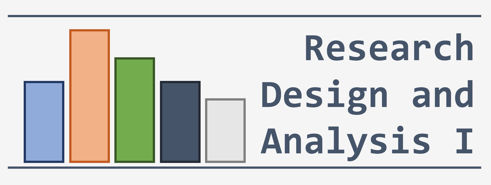
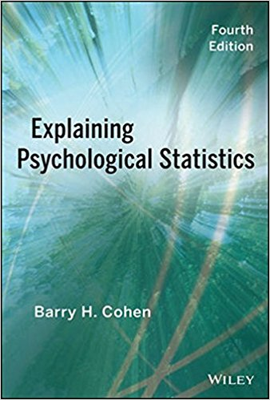

--- 
title: "Quantitative Methods I"
subtitle: "Psy 6600 and Educ 6600"
author: "Sarah Schwartz and Tyson Barrett"
date: "Spring 2018"
site: bookdown::bookdown_site
documentclass: book
bibliography: [book.bib, packages.bib]
biblio-style: apalike
link-citations: yes
description: "This book covers R code."
---

# Psy 6600 or Educ 6600 {-}

The text book:

##COHEN TEXTBOOK, through the USU library

* [View and read it online for free](http://site.ebrary.com/lib/usulibraries/reader.action?docID=10809658)  
    + You must be either on campus or on the VPN

* [Download the entire book for free](https://ebookcentral-proquest-com.dist.lib.usu.edu/lib/USU/detail.action?docID=1563061)
    + requires you to 
        - create an account
        - download/install some software
    + only can be 'checked out' for 14 days

## Download Files

All files may be downloaded from the [BOX folder](https://usu.app.box.com/s/nsnga773p9o823shxr243z39brmlc35y)

* Icons and image files
* Datasets (excel or SPSS format)
* Assignments

## Instructor Websites

* Sarah's website: [www.sarahschwartzstats.com](http://www.sarahschwartzstats.com/)

* Tyson's website: [www.tysonbarrett.com/teaching/](http://tysonbarrett.com/teaching/)

